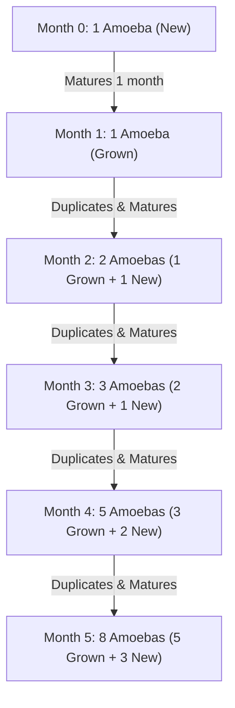
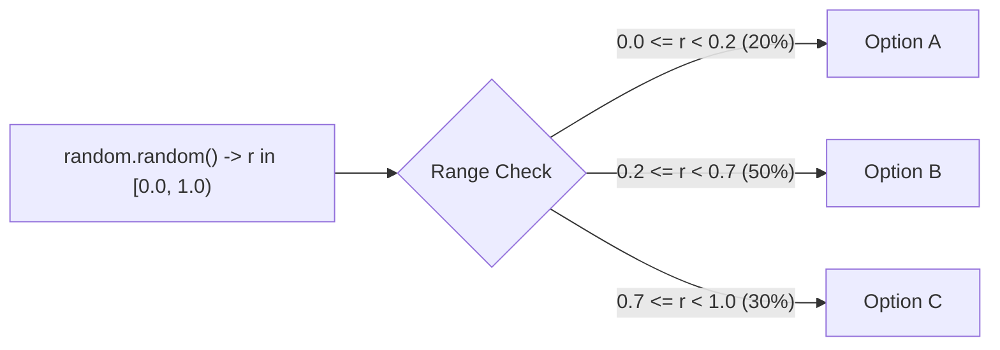
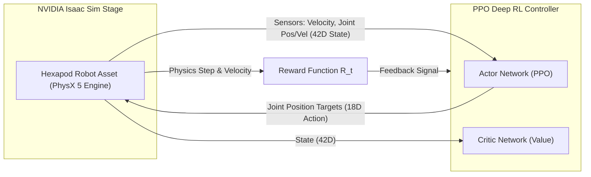

# Lab 1: Refresh on Python

## Amoeba community

1. Assuming a new amoeba takes one month to grow, and from the second month onwards, it takes one month to duplicate itself to create a new amoeba. Given that there is one new amoeba at the beginning of the first month, this is the progression of the number of amoeba in different months.

    - `Month 0`: 1 (new)
    - `Month 1`: 1 (grown)
    - `Month 2`: 1 (grown) + 1 (new) = 2
    - `Month 3`: 2 (grown) + 1 (new) = 3
    - `Month 4`: 3 (grown) + 2 (new) = 5
    - `Month 5`: 5 (grown) + 3 (new) = 8
    - `Month 6`: 8 (grown) + 5 (new) = 13
    - `Month 7`: 13 (grown) + 8 (new) = 21
    - ...



    !!! note "Hint"
        Note the pattern of the sequence

2. Write a function that takes the month number as input argument and provides the number of amoeba at the beginning of that month as output.

    ```python
    def numberofamoeba(month):
      ...
      return number_of_amoeba
    ```

3. Write a function to take the same input argument as `numberofamoeba` but instead of giving the number of amoeba at that month as output, provide the whole sequence of amoeba number starting from the beginning. For example, if `month` is `4`, the output of the function should be the list of `[1,1,2,3,5]`

    ```python
    def numberofamoebaseq(month):
      ...
      return number_seq
    ```

4. Create a scatter plot to plot the sequence of amoeba number from month 0 to month 100.

    !!! note "Hint"
        `import matplotlib.pyplot as plt` to use the Python visualisation library Matplotlib. Scatter plot can be produced with `plt.scatter(...)`.


## Fibonacci and Golden Ratio

1. The above sequence of number is also known as the Fibonacci sequence.

    !!! note "Note"
        A Fibonacci sequence may or may not include a 0 as the first element of the series, i.e. `0,1,1,2,3,5,8,...` instead of `1,1,2,3,5,8`.

2. Plot the ratio between every two consecutive numbers in the Fibonacci sequence. For Fibonacci sequence of `1,1,2,3,5,8,13,21`, plot the line of $\frac{1}{1}$, $\frac{2}{1}$, $\frac{3}{2}$, $\frac{5}{3}$, $\frac{8}{5}$, $\frac{13}{8}$, $\frac{21}{13}$.

    !!! note "Note"
        The longer the Fibonacci sequence you use, the closer is the value of the ratio between two consecutive numbers to be the golden ratio.


3. Generate a series of coordinates following the algorithm:
    1. Start from `(0,0)`.
    2. Get the next Fibonacci number, i.e. `1`.
    3. Add `(+1,+1)` to the previous point `(0,0)` to get `(1,1)`.
    4. Get the next Fibonacci number, i.e. `1`.
    5. Add `(+1,-1)` to the previous point `(1,1)` to get `(2,0)`.
    6. Get the next Fibonacci number, i.e. `2`.
    7. Add `(-2,-2)` to the previous point `(2,0)` to get `(0,-2)`.
    8. Get the next Fibonacci number, i.e. `3`.
    9. Add `(-3,+3)` to the previous point `(0,-2)` to get `(-3,1)`.
    10. Continue with the next Fibonacci number and update the coordinates with the sequence of the signs `(+,+), (+,-), (-,-), (-,+)`.

    The process will create a spiral in the following manner. The sequence of the signs produce the change in directions, and the fibonacci number provides the distance.
    <div style="text-align:center">
    <svg viewBox="-350 -250 600 500" style="width:50%;max-width:500px">
    <defs>
    <marker
    id="triangle"
    viewBox="0 0 10 10"
    refX="1"
    refY="5"
    markerUnits="strokeWidth"
    markerWidth="10"
    markerHeight="10"
    orient="auto">
    <path d="M 0 0 L 10 5 L 0 10 z" fill="#000" />
    </marker>
    </defs>
    <text x="-10" y="00" text-anchor="end" dominant-baseline="hanging">(0,0)</text>
    <circle cx="0" cy="0" r="5" fill="black" />
    <path d="M 0 0 m 5 -5 l 85 -85" stroke="black" marker-end="url(#triangle)" />
    <text x="100" y="-110" text-anchor="middle" dominant-baseline="auto">(1,1)</text>
    <path d="M 0 0 m 100 -100 m 5 5 l 85 85" stroke="black" marker-end="url(#triangle)" />
    <text x="210" y="0" text-anchor="start" dominant-baseline="middle">(2,0)</text>
    <path d="M 0 0 m 100 -100 m 100 100 m -5 5 l -185 185" stroke="black" marker-end="url(#triangle)" />
    <text x="0" y="210" text-anchor="middle" dominant-baseline="hanging">(0,-2)</text>
    <path d="M 0 0 m 100 -100 m 100 100 m -200 200 m -5 -5 l -285 -285" stroke="black" marker-end="url(#triangle)" />
    <text x="-310" y="-100" text-anchor="end" dominant-baseline="middle">(-3,1)</text>
    <path d="M 0 0 m 100 -100 m 100 100 m -200 200 m -300 -300 m 5 -5 l 45 -45" stroke="black" stroke-dasharray="4" marker-end="url(#triangle)" />
    <!-- <path d="M 0 0 l 100 -100 l 100 100 l -200 200 l -300 -300" stroke="black" fill="transparent" /> -->
    </svg>
    </div>


4. Create a line plot of the series of coordinates. If the lines are smoothen, it would form the golden spiral which can be found in pinecorns, seashells, and hurricanes.

    !!! note "Additional"
        If you are interested in how we may plot arc to connect the points instead of using straight lines, you can refer to [Additional: plot arc to form golden spiral](#additional-plot-arc-to-form-golden-spiral).

## Random selection based on probability

For this section. assume the `random.random()` function selects the random number with even probability.

1. Consider a coin tossing event. If the probabilities of getting a head or a tail are even, i.e. 50%. Create a Python function which will simulate the coin tossing event and return the result as `head` or `tail`.

    ```python
    def tossCoin():
      ...
      return headOrTail
    ```

2. If the probabilities of getting a head or a tail are not even, with head as 20% and tail as 80%, how would you change the Python function you created previously to adapt to this coin?

3. Consider the event of selecting one option out of three options randomly. The probability of choosing option `A` is 20%, `B` is 50%, and  `C` is 30%. Create a Python function to simulate the random selection of the options.



    ```python
    def chooseFromThree():
      ...
      return selectedOption
    ```

## Additional: plot arc to form golden spiral

1. The golden spiral can be produced by drawing the arc connecting every consecutive coordinates.
    <div style="text-align:center">
    <svg viewBox="-350 -250 600 500" style="width:50%;max-width:500px">
    <defs>
    <marker
    id="triangle"
    viewBox="0 0 10 10"
    refX="1"
    refY="5"
    markerUnits="strokeWidth"
    markerWidth="10"
    markerHeight="10"
    orient="auto">
    <path d="M 0 0 L 10 5 L 0 10 z" fill="#000" />
    </marker>
    </defs>
    <text x="-10" y="00" text-anchor="end" dominant-baseline="hanging">(0,0)</text>
    <circle cx="0" cy="0" r="5" fill="black" />
    <path d="M 0 0 m 5 -5 l 85 -85" stroke="black" marker-end="url(#triangle)" />
    <text x="100" y="-110" text-anchor="middle" dominant-baseline="auto">(1,1)</text>
    <path d="M 0 0 m 100 -100 m 5 5 l 85 85" stroke="black" marker-end="url(#triangle)" />
    <text x="210" y="0" text-anchor="start" dominant-baseline="middle">(2,0)</text>
    <path d="M 0 0 m 100 -100 m 100 100 m -5 5 l -185 185" stroke="black" marker-end="url(#triangle)" />
    <text x="0" y="210" text-anchor="middle" dominant-baseline="hanging">(0,-2)</text>
    <path d="M 0 0 m 100 -100 m 100 100 m -200 200 m -5 -5 l -285 -285" stroke="black" marker-end="url(#triangle)" />
    <text x="-310" y="-100" text-anchor="end" dominant-baseline="middle">(-3,1)</text>
    <path d="M 0 0 m 100 -100 m 100 100 m -200 200 m -300 -300 m 5 -5 l 45 -45" stroke="black" stroke-dasharray="4" marker-end="url(#triangle)" />
    <path d="M 0 0 A 100 100 0 0 1 100 -100" stroke="#B71C1C" fill="transparent"/>
    <path d="M 0 0 m 100 -100 A 100 100 0 0 1 200 0" stroke="#B71C1C" fill="transparent"/>
    <circle cx="100" cy="0" r="5" fill="#B71C1C" />
    <text x="100" y="10" text-anchor="middle" dominant-baseline="hanging">(1,0)</text>
    <path d="M 0 0 m 100 -100 m 100 100 A 200 200 0 0 1 0 200" stroke="#007517" fill="transparent"/>
    <circle cx="0" cy="0" r="5" fill="#007517" />
    <path d="M 0 0 m 100 -100 m 100 100 m -200 200 A 300 300 0 0 1 -300 -100" stroke="#0064eb" fill="transparent"/>
    <circle cx="0" cy="-100" r="5" fill="#0064eb" />
    <text x="0" y="-110" text-anchor="middle" dominant-baseline="auto">(1,0)</text>
    </svg>
    </div>

2. To draw the arc using `matplotlib` library, we need to identify the center of each arc. The arc and its corresponding center are colored with the same color in the previous figure. 
    ```python linenums="0"
    matplotlib.patches.Arc(
        xy, # center of the arc
        width, # length of horizontal axis, 
        height, # length of vertical axis, 
        angle, # rotation of the ellipse in degrees (counterclockwise)
        theta1, # starting angle of the arc in degrees
        theta2 # end angle of the arc in degrees
    )
    ```

3. The centers of every arc can be generated from the sequence of coordinates using the following function:
    ```python title="function generatecenters"
    def generatecenters(coordinates):
        centers = []
        for i, coord in enumerate(coordinates):
            if i == 0: # add coordinate to list of center
            centers.append([coord[0], coord[1]])
            elif i == 1: # change x-coordinate of the first center
            centers[-1][0] = coord[0]
            else:
            centers.append([centers[-1][0], centers[-1][1]])
            if i % 2 == 0: # use y-coordinate as y for new center
                centers[-1][1] = coord[1]
            else: # use x-coordinate as x for new center
                centers[-1][0] = coord[0]
        return centers
    ```
    The `coordinates` is the list of coordinates generated from [Fibonacci and Golden Ratio](#fibonacci-and-golden-ratio) step 3.

4. The following function will then use the generated centers of the arc, and the Fibonacci sequence generated from `numberofamoebaseq` to draw the arc. The handler of the axis needs to be passed into the function as well.
    ```python title="function plotspiral"
    def plotspiral(axis, series, centers):
        angle = 90
        for number,center in zip(series,centers):
            arc = Arc(
                xy=center, 
                width=2*number, 
                height=2*number, 
                angle=angle,
                theta1=0, 
                theta2=90
            )
            axis.add_patch(arc)
            angle -= 90
    ```

    In your script, you will first generate the Fibonacci sequence, use the sequence to generate coordinates, generate centers of arcs, and plot the arcs to form the spiral.

    ```python
    n = 80
    number_seq = numberofamoebaseq(n)
    coordinates = generatecoordinatesfromseries(number_seq)
    centers = generatecenters(coordinates)
    plt.figure()
    plt.scatter(...) # or plt.plot(...) to plot the coordinates as in Fibonacci and Golden Ratio step 4
    plotspiral(plt.gca(), number_seq, centers) # plt.gca() returns handle of the current axis
    !!! note "Limitation"
        Due to the limitation of matplotlib, the spiral plotting only works for the Fibonacci sequence with length less than 93.

---

You can download the full Python script here: [lab1.py](files/lab1.py)

---


## Additional: Deep Reinforcement Learning for a 6-Legged Walking Robot in NVIDIA Isaac Sim

Deep Reinforcement Learning (DRL) enables autonomous multi-legged robots (such as hexapods) to learn complex locomotion gaits in virtual simulation environments without explicit trajectory programming. NVIDIA Isaac Sim provides GPU-accelerated physics simulation to train DRL locomotion policies in parallel.

### 1. Hexapod Robot Kinematics & Joint Structure

A 6-legged walking robot (hexapod) typically features **18 Degrees-of-Freedom (DOF)**, with 3 actuated joints per leg:
- **Coxa Joint ($q_{\text{hip}}$)**: Controls leg swing forward/backward (yaw).
- **Femur Joint ($q_{\text{thigh}}$)**: Controls leg elevation up/down (pitch).
- **Tibia Joint ($q_{\text{knee}}$)**: Controls leg extension/flexion (pitch).

```
          [ Hexapod Base Body ]
       /         |           \
  Leg 1        Leg 2        Leg 3
  (Front-L)   (Mid-L)      (Rear-L)
  [Coxa]      [Coxa]       [Coxa]
    |           |            |
  [Femur]     [Femur]      [Femur]
    |           |            |
  [Tibia]     [Tibia]      [Tibia]

  Leg 4        Leg 5        Leg 6
  (Front-R)   (Mid-R)      (Rear-R)
```

### 2. DRL Environment Formulation

Reinforcement Learning frames locomotion as a Markov Decision Process (MDP) defined by $(\mathcal{S}, \mathcal{A}, \mathcal{R}, \mathcal{P}, \gamma)$:

1. **Observation Space ($\mathcal{S} \in \mathbb{R}^{42}$)**:
   - Base linear velocity ($v_x, v_y, v_z$)
   - Base angular velocity ($\omega_x, \omega_y, \omega_z$)
   - Gravity vector orientation ($g_x, g_y, g_z$)
   - 18 joint position angles ($q_{1..18}$)
   - 18 joint angular velocities ($\dot{q}_{1..18}$)

2. **Action Space ($\mathcal{A} \in \mathbb{R}^{18}$)**:
   - Target joint position commands $a_t \in [-1.0, 1.0]$ scaled to physical joint limits $[q_{\text{min}}, q_{\text{max}}]$.

3. **Reward Function Design ($\mathcal{R}_t$)**:
   $$\mathcal{R}_t = w_{\text{vel}} \cdot v_x - w_{\text{drift}} \cdot |v_y| - w_{\text{orientation}} \cdot (\|\text{pitch}\| + \|\text{roll}\|) - w_{\text{energy}} \sum_{i=1}^{18} \tau_i \cdot \dot{q}_i$$
   - **Forward Reward**: Encourages maximum forward linear velocity ($v_x$).
   - **Stability Penalty**: Penalizes lateral drift ($v_y$) and body tilt (roll & pitch).
   - **Energy Penalty**: Penalizes excessive motor torques ($\tau$) and joint velocities ($\dot{q}$).



---

### 3. Complete Isaac Sim + PyTorch PPO Implementation Code

You can download the full Python script here: [isaac_hexapod_drl.py](files/isaac_hexapod_drl.py)

Below is the complete standalone Python implementation demonstrating how to set up the 6-legged robot environment in NVIDIA Isaac Sim and train/test a PPO Deep Reinforcement Learning policy using PyTorch.

```python
from omni.isaac.kit import SimulationApp

# Step 1: Initialize NVIDIA Isaac Sim environment
simulation_app = SimulationApp({"headless": False})

import torch
import torch.nn as nn
import torch.optim as optim
import numpy as np
from omni.isaac.core import World
from omni.isaac.core.robots import Robot
from omni.isaac.core.utils.nucleus import get_assets_root_path

# Step 2: Define Actor-Critic Policy Network (PPO) for 6-Legged Locomotion
class HexapodPolicy(nn.Module):
    def __init__(self, obs_dim=42, action_dim=18):
        super(HexapodPolicy, self).__init__()
        # Actor Network (Policy: outputs target joint angles)
        self.actor = nn.Sequential(
            nn.Linear(obs_dim, 256),
            nn.ELU(),
            nn.Linear(256, 128),
            nn.ELU(),
            nn.Linear(128, action_dim),
            nn.Tanh()  # Output normalized actions in range [-1, 1]
        )
        # Critic Network (Value function baseline)
        self.critic = nn.Sequential(
            nn.Linear(obs_dim, 256),
            nn.ELU(),
            nn.Linear(256, 128),
            nn.ELU(),
            nn.Linear(128, 1)
        )
        self.log_std = nn.Parameter(torch.zeros(action_dim))

    def forward(self, state):
        action_mean = self.actor(state)
        state_value = self.critic(state)
        return action_mean, state_value

# Step 3: Initialize Isaac Sim Simulation World & Robot
world = World()
world.scene.add_default_ground_plane()

# Load Hexapod 6-legged robot USD asset into Isaac Sim stage
assets_root_path = get_assets_root_path()
hexapod_usd_path = assets_root_path + "/Isaac/Robots/Ant/ant.usd"  # Standard multi-legged walking asset

hexapod_robot = world.scene.add(
    Robot(
        prim_path="/World/Hexapod",
        name="hexapod_walking_robot",
        usd_path=hexapod_usd_path,
        position=np.array([0.0, 0.0, 0.5])
    )
)

world.reset()
print(f"Hexapod Robot initialized with {hexapod_robot.num_dof} Degrees of Freedom.")

# Step 4: Instantiate DRL Policy & Optimizer
device = torch.device("cuda" if torch.cuda.is_available() else "cpu")
policy = HexapodPolicy(obs_dim=42, action_dim=18).to(device)
optimizer = optim.Adam(policy.parameters(), lr=3e-4)

# Step 5: Reinforcement Learning Execution & Training Loop
num_episodes = 100
max_steps_per_episode = 500

for episode in range(num_episodes):
    world.reset()
    episode_reward = 0.0
    
    for step in range(max_steps_per_episode):
        # 1. Step simulation physics
        world.step(render=True)

        # 2. Get state observations from Isaac Sim robot sensors
        joint_positions = hexapod_robot.get_joint_positions()
        joint_velocities = hexapod_robot.get_joint_velocities()
        base_lin_vel = hexapod_robot.get_linear_velocity()
        base_ang_vel = hexapod_robot.get_angular_velocity()

        # Construct 42-dimensional state vector
        obs = np.concatenate([base_lin_vel, base_ang_vel, np.zeros(3), joint_positions, joint_velocities])
        state_tensor = torch.tensor(obs, dtype=torch.float32, device=device).unsqueeze(0)

        # 3. Predict actions via PPO Policy Network
        with torch.no_grad():
            action_mean, value = policy(state_tensor)
            action = action_mean.squeeze(0).cpu().numpy()

        # 4. Apply joint target position actions to Isaac Sim Hexapod motor drives
        hexapod_robot.apply_action(action)

        # 5. Compute Locomotion Reward
        forward_vel = base_lin_vel[0]
        drift_penalty = abs(base_lin_vel[1])
        reward = forward_vel * 2.0 - drift_penalty * 0.5 - 0.01 * np.sum(np.square(action))
        episode_reward += reward

    print(f"Episode {episode + 1}/{num_episodes} - Total DRL Locomotion Reward: {episode_reward:.2f}")

print("Completed 6-Legged Robot DRL Training in NVIDIA Isaac Sim.")
simulation_app.close()
```

---

<footer style="text-align: center; margin-top: 2em; opacity: 0.8; font-size: 0.85em;">
Copyright Author: Dr Tang Tiong Yew
</footer>
