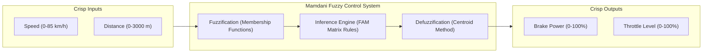
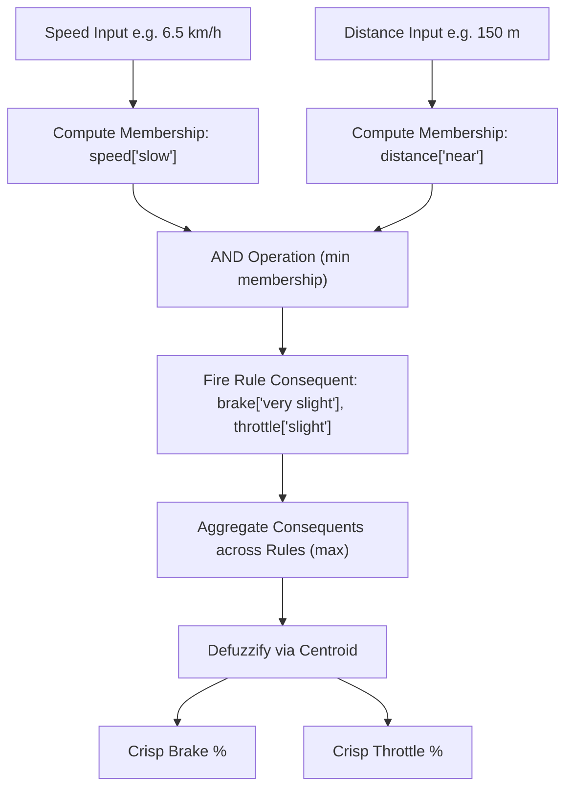

# Lab 2: Fuzzy Systems

## Fuzzy Systems

### Objective

- to construct a Mamdani fuzzy system using the `scikit-fuzzy` Python library
- to evaluate the result of the constructed fuzzy system

### Note

Install the `scikit-fuzzy` Python library in your environment before proceeding with the lab.

```python
conda install -c conda-forge scikit-fuzzy
```

### Fuzzy control system for a train

1. Consider a fuzzy control system to control the **brake** and **throttle** of a train based on the **speed** of the train and the **distance** of the train to the next stop.

2. Import the `skfuzzy`, `skfuzzy.control`, and `numpy`.

    ```python
    import numpy as np
    from skfuzzy import control as ctrl
    from skfuzzy import membership as mf
    ```

#### Initialise inputs and outputs

1. Speed and distance are the inputs of the system whereas brake and throttle are the outputs.

2. The ranges for the variables are:

    |Variable|Range|
    |:--------|:-----:|
    |Speed   | 0 - 85 km/h |
    |Distance| 0 - 3000 m  |
    |Brake   | 0 - 100%    |
    |Throttle| 0 - 100%    |




3. As the inputs will be the antecedents of the rules, construct the variables `speed` and `distance` as `skfuzzy.control.Antecedent` objects. 

    ```python
    speed = ctrl.Antecedent(np.arange(0, 85.1, 0.1), 'speed')
    ```

4. The initialisation function for `skfuzzy.control.Antecedent` object takes 2 arguments, the first is the *universe* of the variable, i.e. the values the variables can take, the second is the label of the variable. The initialisation function for `skfuzzy.control.Consequent` is similar. 

5. The label and the range of the variable can be accessed using `.label` and `.universe` respectively.

<div style='margin-top: 20px'></div>

**Task**: Initialise the variables `distance` as `Antecedent` object, and `brake` and `throttle` as `Consequent` objects. (Outputs of the system will be consequents of the rules)

#### Define membership functions for fuzzy sets of variables

1. The fit vectors of the fuzzy sets for the linguistic variables are given as follows:

    - speed (0 to 85 km/h)

        |Linguistic value|Fit vector           |
        |----------------|---------------------|
        |Stopped         |(1/0, 0/2)            |
        |Very slow       |(0/1, 1/2.5, 0/4)      |
        |Slow            |(0/2.5, 1/6.5, 0/10.5) |
        |Medium fast     |(0/6.5, 1/26.5, 0/46.5)|
        |Fast            |(0/26.5, 1/70, 1/85)   |

    - distance (0 to 3000 m)

        |Linguistic value|Fit vector            |
        |----------------|----------------------|
        |At              |(1/0, 0/2)             |
        |Very near       |(0/1, 1/3, 0/5)         |
        |Near            |(0/3, 1/101.5, 0/200)   |
        |Medium far      |(0/100, 1/1550, 0/3000) |
        |Far             |(0/1500, 1/2250, 1/3000)|


    - brake (0 to 100%)

        |Linguistic value|Fit vector|
        |----------------|----------|
        |No              |(1/0, 0/40)|
        |Very slight     |(0/20, 1/50, 0/80)|
        |Slight          |(0/70, 1/83.5, 0/97)|
        |Medium          |(0/95, 1/97, 0/99)|
        |Full            |(0/98, 1/100)|

    - throttle (0 to 100%)

        |Linguistic value|Fit vector|
        |----------------|----------|
        |No              |(1/0, 0/2)|
        |Very slight     |(0/1, 1/3, 0/5)|
        |Slight          |(0/3, 1/16.5, 0/30)|
        |Medium          |(0/20, 1/50, 0/80)|
        |Full            |(0/60, 1/80, 1/100)|

2. The `skfuzzy.membership` module provides the following membership functions:

    |Membership function |Description |
    |--------------------|------------|
    |`skfuzzy.membership.dsigmf(x, b1, c1, b2, c2)`|Difference of two fuzzy sigmoid membership functions|
    |`skfuzzy.membership.gauss2mf(x, mean1, ...)`|Gaussian fuzzy membership function of two combined Gaussians|
    |`skfuzzy.membership.gaussmf(x, mean, sigma)`|Gaussian fuzzy membership function|
    |`skfuzzy.membership.gbellmf(x, a, b, c)`|Generalized Bell function fuzzy membership generator|
    |`skfuzzy.membership.piecemf(x, abc)`|Piecewise linear membership function (particularly used in FIRE filters)|
    |`skfuzzy.membership.pimf(x, a, b, c, d)`|Pi-function fuzzy membership generator|
    |`skfuzzy.membership.psigmf(x, b1, c1, b2, c2)`|Product of two sigmoid membership functions|
    |`skfuzzy.membership.sigmf(x, b, c)`|The basic sigmoid membership function generator|
    |`skfuzzy.membership.smf(x, a, b)`|S-function fuzzy membership generator|
    |`skfuzzy.membership.trapmf(x, abcd)`|Trapezoidal membership function generator|
    |`skfuzzy.membership.trimf(x, abc)`|Triangular membership function generator|
    |`skfuzzy.membership.zmf(x, a, b)`|Z-function fuzzy membership generator|

3. The fit vector of a linguistic value can be assigned to a linguistic variable using

    ```python
    speed['stopped'] = mf.trimf(speed.universe, [0, 0, 2])
    speed['very slow'] = mf.trimf(speed.universe, [1, 2.5, 4])
    ```

    **Task**: Assign all fuzzy sets to the linguistic variables.

4. The fuzzy set diagram of a linguistic variable can be viewed using `.view()`

    ```python
    speed.view()
    ```

    **Task**: Check if the fuzzy set diagrams match the fit vectors.

#### Define rules

1. The rules for this system are displayed in the following fuzzy association memory (FAM) representation table.

    <div class="md-typeset__scrollwrap">
    <table class="fam-table">
    <tr>
      <td colspan='2'></td>
      <td colspan='5'>Distance</td>
    </tr>
    <tr>
      <td colspan='2'></td>
      <td>At</td>
      <td>Very near</td>
      <td>Near</td>
      <td>Medium far</td>
      <td>Far</td>
    </tr>
    <tr>
      <td rowspan='5'>Speed</td>
      <td>Stopped</td>
      <td>Full brake<br>No throttle</td>
      <td>Full brake<br>Very slight throttle</td>
      <td></td>
      <td></td>
      <td></td>
    </tr>
    <tr>
      <td>Very slow</td>
      <td>Full brake<br>No throttle</td>
      <td>Medium brake<br>Very slight throttle</td>
      <td>Slight brake<br>Very slight throttle</td>
      <td></td>
      <td></td>
    </tr>
    <tr>
      <td>Slow</td>
      <td>Full brake<br>No throttle</td>
      <td>Medium brake<br>Very slight throttle</td>
      <td>Very slight brake<br>Slight throttle</td>
      <td></td>
      <td></td>
    </tr>
    <tr>
      <td>Medium fast</td>
      <td></td>
      <td></td>
      <td></td>
      <td>Very slight brake<br>Medium throttle</td>
      <td>No brake<br>Full throttle</td>
    </tr>
    <tr>
      <td>Fast</td>
      <td></td>
      <td></td>
      <td></td>
      <td>Very slight brake<br>Medium throttle</td>
      <td>No brake<br>Full throttle</td>
    </tr>
    </table>
    </div>

2. Rule can be defined using `skfuzzy.control.Rule(antecedent, consequent, label)`. To define the first rule, i.e. if distance is 'at' and speed is 'stopped', then full brake and no throttle, 

    ```python
    rule1 = ctrl.Rule(distance['at'] & speed['stopped'], (brake['full'], throttle['no']))
    ```



    If the antecedent consists of multiple parts, they can be combined using operators `|` (OR), `&` (AND), and `~` (NOT).

    If the consequent consists of multiple parts, they can be combined as a `list`/`tuple`.

    **Task**: Define all the rules. Then combine all the rules in a `list`, i.e. `rules = [rule1, rule2, ...]`.

    !!! warning "Rule coverage"
        Blank FAM cells produce no output when no other membership overlaps a
        populated cell. That is acceptable for this focused exercise, but a
        real train controller must define safe behavior over the entire input
        space rather than silently replacing undefined outputs with zero.

#### Construct the fuzzy control system
1. The train control system can be constructed with
    
    ```python
    train_ctrl = ctrl.ControlSystem(rules=rules)
    ```

2. A `skfuzzy.control.ControlSystemSimulation` object is needed to simulate the control system to obtain the outputs given certain inputs.

    ```python
    train = ctrl.ControlSystemSimulation(control_system=train_ctrl)
    ```

3. To obtain the values for `brake` and `throttle` given that `speed` is
   30 km/h and `distance` is 2000 m,

    ```python
    # define the values for the inputs
    train.input['speed'] = 30
    train.input['distance'] = 2000

    # compute the outputs
    train.compute()

    # print the output values
    print(train.output)

    # to extract one of the outputs
    print(train.output['brake'])
    ```

4. To view the results in the graph,

    ```python
    brake.view(sim=train)
    throttle.view(sim=train)
    ```

#### View the control/output space

1. The control/output space allows us to identify if the outputs fit our expectation.

2. Construct an empty 3D space with 100-by-100 x-y grid.

    ```python
    x, y = np.meshgrid(np.linspace(speed.universe.min(), speed.universe.max(), 100),
                       np.linspace(distance.universe.min(), distance.universe.max(), 100))
    z_brake = np.zeros_like(x, dtype=float)
    z_throttle = np.zeros_like(x, dtype=float)
    ```

3. Loop through every point and identify the value of brake and throttle of each point. As the specified rules are not exhaustive, i.e. some input combinations do not activate any rule, we will set the output of such input combinations to be `float('inf')`.
    ```python
    for i,r in enumerate(x):
      for j,c in enumerate(r):
        train.input['speed'] = x[i,j]
        train.input['distance'] = y[i,j]
        try:
          train.compute()
        except:
          z_brake[i,j] = float('inf')
          z_throttle[i,j] = float('inf')
        z_brake[i,j] = train.output['brake']
        z_throttle[i,j] = train.output['throttle']
    ```

4. Plot the result in a 3D graph using the `matplotlib.pyplot` library.

    ```python
    import matplotlib.pyplot as plt
    from mpl_toolkits.mplot3d import Axes3D

    def plot3d(x,y,z):
      fig = plt.figure()
      ax = fig.add_subplot(111, projection='3d')

      ax.plot_surface(x, y, z, rstride=1, cstride=1, cmap='viridis', linewidth=0.4, antialiased=True)

      ax.contourf(x, y, z, zdir='z', offset=-2.5, cmap='viridis', alpha=0.5)
      ax.contourf(x, y, z, zdir='x', offset=x.max()*1.5, cmap='viridis', alpha=0.5)
      ax.contourf(x, y, z, zdir='y', offset=y.max()*1.5, cmap='viridis', alpha=0.5)

      ax.view_init(30, 200)

    plot3d(x, y, z_brake)
    plot3d(x, y, z_throttle)
    ```

### Fuzzy tipping recommendation system

1. A fuzzy expert system is designed to identify the percentage of tips a customer will give based on the service and the food the customer received.

2. The system has service and food as inputs, and tips as output.

3. The fit vectors of the fuzzy sets for the linguistic variables are given as follows:

    - service (0 to 10)

        |Linguistic value|Fit vector           |
        |----------------|---------------------|
        |Poor            |(1/0, 0/5)           |
        |Average         |(0/0, 1/5, 0/10)     |
        |Good            |(0/5, 1/10)          |

    - food (0 to 10)

        |Linguistic value|Fit vector           |
        |----------------|---------------------|
        |Poor            |(1/0, 0/5)           |
        |Average         |(0/0, 1/5, 0/10)     |
        |Good            |(0/5, 1/10)          |
        
    - tips (0 to 30%)

        |Linguistic value|Fit vector           |
        |----------------|---------------------|
        |Low             |(1/0, 0/15)          |
        |Medium          |(0/0, 1/15, 0/30)    |
        |High            |(0/15, 1/30)         |

4. The rules are displayed in the following fuzzy association memory (FAM) representation table.

    <div class="md-typeset__scrollwrap">
    <table class="fam-table">
    <tr>
      <td colspan='2'></td>
      <td colspan='3'>Food</td>
    </tr>
    <tr>
      <td colspan='2'></td>
      <td>Poor</td>
      <td>Average</td>
      <td>Good</td>
    </tr>
    <tr>
      <td rowspan='3'>Service</td>
      <td>Poor</td>
      <td>low tips</td>
      <td>low tips</td>
      <td>medium tips</td>
    </tr>
    <tr>
      <td>Average</td>
      <td>low tips</td>
      <td>medium tips</td>
      <td>high tips</td>
    </tr>
    <tr>
      <td>Good</td>
      <td>medium tips</td>
      <td>high tips</td>
      <td>high tips</td>
    </tr>
    </table>
    </div>

<div style='margin-top: 20px'></div>

**Task**: Construct the fuzzy inference system.

<div style='margin-top: 20px'></div>

  |Linguistic value|Fit vector           |
  |----------------|---------------------|
  |Poor            |(1/0, 0/3)           |
  |Average         |(0/2, 1/5, 0/8)      |
  |Good            |(0/6, 1/10)          |

---

You can download the full Python script here: [lab2_fuzzy.py](files/lab2_fuzzy.py)

---


## NVIDIA Isaac Sim Example: Fuzzy Logic Robot Obstacle Avoidance Controller

Fuzzy Logic Controllers (FLCs) are widely used in mobile robotics to handle uncertainty and nonlinear dynamics. This example builds a **Mamdani fuzzy inference system** with `scikit-fuzzy` and uses Isaac Sim to visualise the resulting planar motion. It is an educational controller demonstration: distance and heading are calculated from scene geometry, and the robot pose is updated directly rather than through simulated range sensors, wheel joints, or contact physics.

### 1. Fuzzy Logic Controller Architecture

The controller uses 2 inputs (distance to obstacle & heading error to target) and computes 2 control outputs (linear velocity & angular steering velocity):

```
       +-----------------------+
       |   NVIDIA Isaac Sim    |
       | Scene Geometry/Pose   |
       +-----------+-----------+
                   |
     [distance]    |    [heading]
                   v
       +-----------+-----------+
       |  scikit-fuzzy Engine  |
       | Fuzzification -> Rules |
       | -> Defuzzification    |
       +-----------+-----------+
                   |
   [linear_vel]    |    [angular_vel]
                   v
       +-----------+-----------+
       |  NVIDIA Isaac Sim     |
       | Visual Pose Update    |
       +-----------------------+
```

#### Inputs (Antecedents)
1. **`distance` ($0 \text{ to } 5 \text{ m}$)**: Geometric distance from the robot to the obstacle centre, clipped to the input range.
   - `near`: `[0.0, 0.0, 1.5]`
   - `medium`: `[1.0, 2.5, 4.0]`
   - `far`: `[3.0, 5.0, 5.0]`
2. **`heading` ($-180^\circ \text{ to } +180^\circ$)**: Angle offset towards target destination.
   - `right`: `[-180, -90, 0]`
   - `straight`: `[-30, 0, 30]`
   - `left`: `[0, 90, 180]`

#### Outputs (Consequents)
1. **`linear_velocity` ($0 \text{ to } 1.5 \text{ m/s}$)**: Forward speed of the robot.
   - `stop`: `[0.0, 0.0, 0.3]`
   - `slow`: `[0.2, 0.6, 1.0]`
   - `fast`: `[0.8, 1.5, 1.5]`
2. **`angular_velocity` ($-2.0 \text{ to } +2.0 \text{ rad/s}$)**: Steering turn rate.
   - `turn_right`: `[-2.0, -1.0, 0.0]`
   - `straight`: `[-0.3, 0.0, 0.3]`
   - `turn_left`: `[0.0, 1.0, 2.0]`

---

### 2. Complete Isaac Sim + `scikit-fuzzy` Script

You can download the full Python script here: [isaac_fuzzy_robot.py](files/isaac_fuzzy_robot.py)

Below is the complete standalone Python script demonstrating how to construct the Mamdani Fuzzy System and run it inside the NVIDIA Isaac Sim simulation loop.

```python
# Copyright Author: Dr Tang Tiong Yew
r"""
Fuzzy Logic Robot Obstacle Avoidance Controller in NVIDIA Isaac Sim
===================================================================
This script demonstrates Mamdani Fuzzy Logic Control for autonomous mobile robot navigation
and obstacle avoidance inside NVIDIA Isaac Sim using `scikit-fuzzy`.

Execution Modes:
1. NVIDIA Isaac Sim Mode (3D visualisation with direct pose updates):
   Run with Isaac Sim's standalone python:
   Windows: `C:\isaacsim\python.bat src\files\isaac_fuzzy_robot.py`
   Linux: `~/isaacsim/python.sh src/files/isaac_fuzzy_robot.py`

2. Standalone Fallback Mode (scikit-fuzzy controller simulation):
   `python3 src/files/isaac_fuzzy_robot.py`
"""

import sys
import time
import numpy as np

HAS_SKFUZZY = False
try:
    import skfuzzy as fuzz
    from skfuzzy import control as ctrl
    HAS_SKFUZZY = True
except ImportError:
    HAS_SKFUZZY = False

# Try importing NVIDIA Isaac Sim modules
HAS_ISAAC_SIM = False
try:
    from isaacsim import SimulationApp
    HAS_ISAAC_SIM = True
except ImportError:
    try:
        from omni.isaac.kit import SimulationApp
        HAS_ISAAC_SIM = True
    except ImportError:
        HAS_ISAAC_SIM = False


# =====================================================================
# Build Mamdani Fuzzy Inference System Architecture
# =====================================================================
def build_fuzzy_controller():
    """Constructs scikit-fuzzy Antecedents, Consequents, and Rules."""
    distance = ctrl.Antecedent(np.arange(0, 5.1, 0.1), 'distance')
    heading = ctrl.Antecedent(np.arange(-180, 181, 1), 'heading')
    linear_vel = ctrl.Consequent(np.arange(0, 1.6, 0.1), 'linear_vel')
    angular_vel = ctrl.Consequent(np.arange(-2.0, 2.1, 0.1), 'angular_vel')

    # Define membership functions
    distance['near'] = fuzz.trimf(distance.universe, [0.0, 0.0, 1.5])
    distance['medium'] = fuzz.trimf(distance.universe, [1.0, 2.5, 4.0])
    distance['far'] = fuzz.trimf(distance.universe, [3.0, 5.0, 5.0])

    heading['right'] = fuzz.trimf(heading.universe, [-180, -90, 0])
    heading['straight'] = fuzz.trimf(heading.universe, [-30, 0, 30])
    heading['left'] = fuzz.trimf(heading.universe, [0, 90, 180])

    linear_vel['stop'] = fuzz.trimf(linear_vel.universe, [0.0, 0.0, 0.3])
    linear_vel['slow'] = fuzz.trimf(linear_vel.universe, [0.2, 0.6, 1.0])
    linear_vel['fast'] = fuzz.trimf(linear_vel.universe, [0.8, 1.5, 1.5])

    angular_vel['turn_right'] = fuzz.trimf(angular_vel.universe, [-2.0, -1.0, 0.0])
    angular_vel['straight'] = fuzz.trimf(angular_vel.universe, [-0.3, 0.0, 0.3])
    angular_vel['turn_left'] = fuzz.trimf(angular_vel.universe, [0.0, 1.0, 2.0])

    # Define Fuzzy Association Memory (FAM) Rules
    rule1 = ctrl.Rule(distance['near'], (linear_vel['stop'], angular_vel['turn_left']))
    rule2 = ctrl.Rule(distance['medium'] & heading['straight'], (linear_vel['slow'], angular_vel['straight']))
    rule3 = ctrl.Rule(distance['far'] & heading['straight'], (linear_vel['fast'], angular_vel['straight']))
    rule4 = ctrl.Rule(heading['left'], (linear_vel['slow'], angular_vel['turn_left']))
    rule5 = ctrl.Rule(heading['right'], (linear_vel['slow'], angular_vel['turn_right']))

    fuzzy_control_system = ctrl.ControlSystem([rule1, rule2, rule3, rule4, rule5])
    return ctrl.ControlSystemSimulation(fuzzy_control_system)


# =====================================================================
# 1. NVIDIA Isaac Sim Implementation
# =====================================================================
def run_isaac_sim_fuzzy(max_steps=200, step_delay_seconds=1.0):
    """Executes Fuzzy Logic Robot Controller inside NVIDIA Isaac Sim stage."""
    try:
        from isaacsim import SimulationApp
        simulation_app = SimulationApp({"headless": False})
    except ImportError:
        from omni.isaac.kit import SimulationApp
        simulation_app = SimulationApp({"headless": False})

    # Isaac Sim 5.0+ moved the core API from ``omni.isaac`` to ``isaacsim``.
    # Retain the legacy import so this example also works with older releases.
    try:
        from isaacsim.core.api import World
    except ImportError:
        from omni.isaac.core import World

    from pxr import Gf, UsdGeom, UsdLux
    import omni.usd
    from omni.kit.viewport.utility import get_active_viewport

    world = World()
    stage = omni.usd.get_context().get_stage()

    # Build the entire demonstration from local USD primitives, avoiding the
    # online Isaac asset normally used by ``add_default_ground_plane``.
    ground = UsdGeom.Cube.Define(stage, "/World/Ground")
    ground.CreateSizeAttr(1.0)
    ground.AddTranslateOp().Set(Gf.Vec3d(0.0, 0.0, -0.12))
    ground.AddScaleOp().Set(Gf.Vec3f(12.0, 12.0, 0.12))
    ground.CreateDisplayColorAttr([Gf.Vec3f(0.18, 0.20, 0.24)])

    dome_light = UsdLux.DomeLight.Define(stage, "/World/DomeLight")
    dome_light.CreateIntensityAttr(500.0)
    dome_light.CreateColorAttr(Gf.Vec3f(1.0, 1.0, 1.0))

    obstacle = UsdGeom.Cube.Define(stage, "/World/Obstacle")
    obstacle.CreateSizeAttr(1.0)
    obstacle.AddTranslateOp().Set(Gf.Vec3d(2.0, 0.0, 0.5))
    obstacle.AddScaleOp().Set(Gf.Vec3f(0.6, 0.6, 0.5))
    obstacle.CreateDisplayColorAttr([Gf.Vec3f(0.9, 0.12, 0.10)])

    target_position = np.array([5.0, 3.0], dtype=float)
    target = UsdGeom.Sphere.Define(stage, "/World/Target")
    target.CreateRadiusAttr(0.35)
    target.AddTranslateOp().Set(Gf.Vec3d(float(target_position[0]), float(target_position[1]), 0.35))
    target.CreateDisplayColorAttr([Gf.Vec3f(0.1, 0.85, 0.2)])

    robot = UsdGeom.Xform.Define(stage, "/World/FuzzyRobot")
    robot_translate = robot.AddTranslateOp()
    robot_rotate = robot.AddRotateZOp()
    robot_translate.Set(Gf.Vec3d(-4.0, 0.0, 0.25))
    robot_rotate.Set(0.0)

    robot_body = UsdGeom.Cube.Define(stage, "/World/FuzzyRobot/Body")
    robot_body.CreateSizeAttr(1.0)
    robot_body.AddScaleOp().Set(Gf.Vec3f(0.55, 0.38, 0.25))
    robot_body.CreateDisplayColorAttr([Gf.Vec3f(0.05, 0.35, 0.95)])

    direction_marker = UsdGeom.Cube.Define(stage, "/World/FuzzyRobot/DirectionMarker")
    direction_marker.CreateSizeAttr(1.0)
    direction_marker.AddTranslateOp().Set(Gf.Vec3d(0.62, 0.0, 0.20))
    direction_marker.AddScaleOp().Set(Gf.Vec3f(0.35, 0.10, 0.08))
    direction_marker.CreateDisplayColorAttr([Gf.Vec3f(1.0, 0.85, 0.05)])

    camera_path = "/World/FuzzyCamera"
    camera = stage.DefinePrim(camera_path, "Camera")
    camera_xform = UsdGeom.Xformable(camera)
    camera_xform.AddTranslateOp().Set(Gf.Vec3d(-11.0, 0.0, 11.0))
    # This view looks from the start of the route towards its centre.
    camera_xform.AddRotateXYZOp().Set(Gf.Vec3f(45.0, 0.0, -90.0))
    viewport = get_active_viewport()
    if viewport:
        viewport.camera_path = camera_path

    fuzzy_sim = build_fuzzy_controller()

    world.reset()
    print("[INFO] Starting Fuzzy Logic Control Loop in NVIDIA Isaac Sim...")

    step_count = 0
    robot_position = np.array([-4.0, 0.0], dtype=float)
    robot_heading = 0.0
    obstacle_position = np.array([2.0, 0.0], dtype=float)
    obstacle_clearance_radius = 0.9
    visual_time_step = 0.10
    while simulation_app.is_running() and step_count < max_steps:
        world.step(render=True)

        obstacle_dist = np.linalg.norm(robot_position - obstacle_position) - obstacle_clearance_radius
        measured_obstacle_dist = float(np.clip(obstacle_dist, 0.0, 5.0))
        target_vector = target_position - robot_position
        desired_heading = np.arctan2(target_vector[1], target_vector[0])
        heading_error = (desired_heading - robot_heading + np.pi) % (2 * np.pi) - np.pi
        measured_heading_error = float(np.degrees(heading_error))

        fuzzy_sim.input['distance'] = measured_obstacle_dist
        fuzzy_sim.input['heading'] = measured_heading_error

        try:
            fuzzy_sim.compute()
            target_v = fuzzy_sim.output.get('linear_vel', 0.5)
            target_w = fuzzy_sim.output.get('angular_vel', 0.0)
        except Exception:
            target_v = 0.5
            target_w = 0.0

        # Animate the local robot directly from the fuzzy velocity outputs.
        robot_heading += target_w * visual_time_step
        robot_position += target_v * visual_time_step * np.array(
            [np.cos(robot_heading), np.sin(robot_heading)]
        )
        robot_translate.Set(Gf.Vec3d(float(robot_position[0]), float(robot_position[1]), 0.25))
        robot_rotate.Set(float(np.degrees(robot_heading)))

        if step_count % 20 == 0:
            print(f"[Step {step_count:03d}] Distance: {measured_obstacle_dist:.2f}m | Heading: {measured_heading_error:.1f}° "
                  f"--> Fuzzy Outputs: Linear Vel = {target_v:.2f} m/s, Angular Vel = {target_w:.2f} rad/s")

        step_count += 1
        # Keep each rendered state visible in the Isaac Sim GUI.  With the
        # default 200 steps and one-second delay, the demo lasts ~200 seconds.
        if step_delay_seconds > 0:
            time.sleep(step_delay_seconds)

    print("[SUCCESS] Completed Fuzzy Logic Controller simulation in Isaac Sim.")
    simulation_app.close()


# =====================================================================
# 2. Standalone Fallback Execution
# =====================================================================
def run_fallback_fuzzy(max_steps=100):
    """Fallback simulation running scikit-fuzzy controller without Isaac Sim GUI."""
    print("===============================================================")
    print(" Running Standalone Fuzzy Logic Controller (No Isaac Sim GUI)  ")
    print("===============================================================")

    if not HAS_SKFUZZY:
        print("[!] scikit-fuzzy library ('skfuzzy') is required to run the Fuzzy controller.")
        print("    Install it via: pip install scikit-fuzzy")
        print("\n[INFO] Demonstrating heuristic navigation rule fallback:")
        for step in range(0, max_steps, 20):
            simulated_obstacle_dist = max(0.5, 5.0 - (step * 0.04))
            simulated_heading_error = 20.0 if step < 50 else -30.0
            target_v = 0.2 if simulated_obstacle_dist < 1.5 else 1.2
            target_w = 0.8 if simulated_heading_error > 0 else -0.8
            print(f"[Step {step:03d}] Dist: {simulated_obstacle_dist:.2f}m | Heading: {simulated_heading_error:+.1f}° "
                  f"--> Linear Vel = {target_v:.2f} m/s | Angular Vel = {target_w:+.2f} rad/s")
        return

    fuzzy_sim = build_fuzzy_controller()

    for step in range(max_steps):
        simulated_obstacle_dist = max(0.5, 5.0 - (step * 0.04))
        simulated_heading_error = 20.0 if step < 50 else -30.0

        fuzzy_sim.input['distance'] = simulated_obstacle_dist
        fuzzy_sim.input['heading'] = simulated_heading_error

        try:
            fuzzy_sim.compute()
            target_v = fuzzy_sim.output.get('linear_vel', 0.5)
            target_w = fuzzy_sim.output.get('angular_vel', 0.0)
        except Exception:
            target_v = 0.5
            target_w = 0.0

        if step % 10 == 0:
            print(f"[Step {step:03d}] Dist: {simulated_obstacle_dist:.2f}m | Heading: {simulated_heading_error:+.1f}° "
                  f"--> Linear Vel = {target_v:.2f} m/s | Angular Vel = {target_w:+.2f} rad/s")

    print("[SUCCESS] Standalone Fuzzy Logic controller simulation finished cleanly.")


if __name__ == '__main__':
    if HAS_ISAAC_SIM and HAS_SKFUZZY:
        print("[INFO] NVIDIA Isaac Sim detected. Launching stage...")
        run_isaac_sim_fuzzy()
    else:
        print("[INFO] Running Standalone Mode.")
        run_fallback_fuzzy()
```

---

<footer style="text-align: center; margin-top: 2em; opacity: 0.8; font-size: 0.85em;">
Copyright Author: Dr Tang Tiong Yew
</footer>
