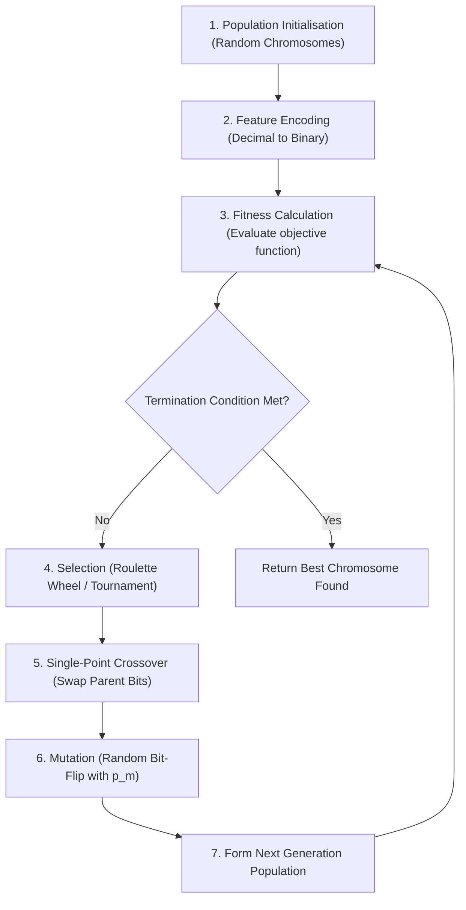
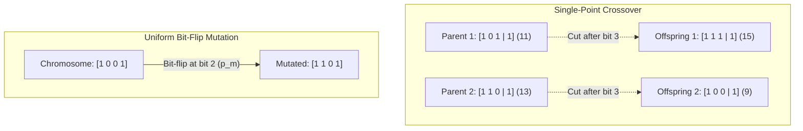
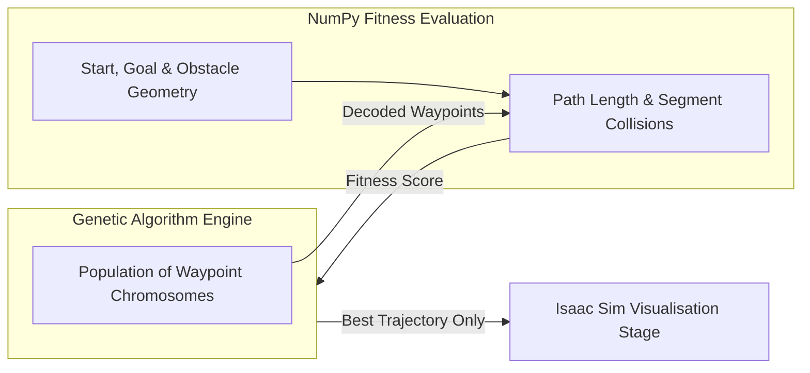

# Lab 3: EC (GA)

<!-- ## Binary-to-gray code conversion

Binary string is often used in the implementation of genetic algorithm. However, the downside of using a binary code is that the Hamming distance between two adjacent values is not consistent. This situation is solved by using a Gray code in place of a binary code.

1. `numpy` provides the function of [`binary_repr`](https://het.as.utexas.edu/HET/Software/Numpy/reference/generated/numpy.binary_repr.html) to convert a decimal value to its corresponding binary code.

2. Create a function to take the input of a binary code and return the corresponding Gray code of the binary code.

3. Create a function to calculate the Hamming distance between two binary strings (two binary codes or two Gray codes).

4. Consider a sequence of decimal values of `[1, 2, 3, 4, 5, 6, 7, 8, 9, 10]`. Convert the sequence to a series of binary codes. Identify and plot ([example of a line plot](https://matplotlib.org/3.1.1/gallery/lines_bars_and_markers/simple_plot.html#sphx-glr-gallery-lines-bars-and-markers-simple-plot-py)) the Hamming distances between the adjacent values.

5. Repeat the previous step with Gray codes instead of binary codes. -->

## Genetic algorithm

Consider the following problem: 

!!! abstract "Problem"
    You are given a sheet of paper with width `w` and height `h`. Your task is to cut it into equal squares. In this exercise, the scalar objective is the **total used paper area**: the number of complete squares multiplied by the area of one square. This rewards efficient use of the sheet; it does not independently maximise both the square count and each square's size.

1. An optimisation problem can always be phrased in the form of

    !!! note ""
        to optimise ... such that it maximises/minimises ...

    In this problem, what is the parameter to be optimised and what are the parameters to be maximised or minimised?

2. Let `x` denote the side length of a square. Use $\lfloor w/x\rfloor\lfloor h/x\rfloor x^2$ as the fitness. If no complete square can be cut, or `x` is zero, the fitness is zero. If the two goals must instead be optimised separately, formulate the task as a multi-objective problem and examine its Pareto front.

<div class="timeline">
<div class="container right"><div class="content"><a href='#feature-encoding'>feature encoding</a></div></div>
<div class="container right"><div class="content"><a href='#population-initialisation'>population initialisation</a></div></div>
<div class="container right"><div class="content"><a href="#selection-as-parents">selection as parents</a></div></div>
<div class="container right"><div class="content"><a href="#crossover">crossover</a></div></div>
<div class="container right"><div class="content"><a href="#mutation">mutation</a></div></div>
<div class="container right"><div class="content"><a href="#">offspring (next generation population)</a></div></div>
<div class="container right"><div class="content"><a href="#repeat-until-termination">repeat from fitness calculation until termination</a></div></div>
</div>



<!-- Use the following template for the code development of the rest of this lab. -->

<!-- ```python
def value2gray(value):
  # this function converts a decimal value to its gray code representation
  ...
  return gray

def gray2value(gray):
  # this function converts a gray code representation to its decimal value
  ...
  return value

def generatePopulation(population_size, population_min, population_max):
  # this function generate the first generation randomly based on the population size and the range of the value of each chromosome
  ...
  return population

def calculateFitness(value):
  # this function calculates the fitness of a chromosome from the decimal value of the chromosome
  ...
  return fitness

def roulettewheelSelection(chromosomes, n):
  # this function takes a list of chromosomes and select n number of chromosomes using roulette wheel selection
  ...
  return selected_chromosomes

def onepointCrossover(parents):
  # this function takes two parents and perform one-point crossover to produce two offsprings
  ...
  return offsprings

def mutation(chromosome, p_m):
  # this function takes a chromosome and perform uniform mutation using the mutation probability of p_m
  ...
  return mutated

if __name__ == "__main__":
  # main function
  ## initialise population
  ...
  while (<termination conditions>):
    ## calculate fitness
    ...
    ## select for mating
    ...
    ## select parent pairs
    ...
    ## perform crossover
    ...
    ## perform mutation
    ...
    ## update current population
    ...
``` -->

### Feature encoding

<!-- 1. In this problem as we only have one feature, i.e. the side length of the square, each chromosome consists of the value of the side length of the square. We will encode the chromosome in the form of Gray code. 

2. Create two functions `value2gray` and `gray2value` to convert a decimal value to its Gray code and vice versa.

    ```python
    def value2gray(value):
      # this function converts a decimal value to its gray code representation
      ...
      return gray

    def gray2value(gray):
      # this function converts a gray code representation to its decimal value
      ...
      return value
    ```

3. Add the following code snippet to the end of the code to test your functions.

    ```python
    if __name__ == "__main__":
      print(value2gray(10))
      print(gray2value("1001"))
    ```

    After running the file as a script, you should see the following output.

    ```
    1111
    14
    ``` -->

1. In this problem as we only have one feature, i.e. the side length of the square, each chromosome consists of the value of the side length of the square. We will encode the chromosome in the form of binary code. 

2. Create two functions `value2binary` and `binary2value` to convert a decimal value to its binary code and vice versa.

    ```python
    def value2binary(value):
      # this function converts a decimal value to its binary code representation
      ...
      return binary

    def binary2value(binary):
      # this function converts a binary code representation to its decimal value
      ...
      return value
    ```

3. Add the following code snippet to the end of the code to test your functions.

    ```python
    if __name__ == "__main__":
      print(value2binary(10))
      print(binary2value("1001"))
    ```

    After running the file as a script, you should see the following output.

    ```
    1010
    9
    ```

### Population initialisation

1. A population is randomly generated according to the defined population size. 

2. Create a function to generate randomly a population of size `pop_size` with each value lies between the range of `pop_min` to `pop_max`.

    ```python
    def generatePopulation(pop_size, pop_min, pop_max):
      # this function generate the first generation randomly based on the population size and the range of the value of each chromosome
      ...
      return population
    ```

    This function and all the functions created after this should be placed before the `if __name__ == "__main__":` code block.

3. [Optional testing] You can test the function by changing the `__main__` code block to 

    ```python
    if __name__ == "__main__":
      print(generatePopulation(8, 0, 10))
    ```

    The printed output should be a series of 8 chromosomes displayed as decimal values.

### Fitness calculation

1. The fitness function was designed at the beginning of [this section](#genetic-algorithm). Define a function that takes the input of a chromosome (as decimal value) and returns the fitness of the chromosome.

    ```python
    def calculateFitness(value):
      # this function calculates the fitness of a chromosome from the decimal value of the chromosome
      ...
      return fitness
    ```
2. [Optional] Test the function with

    ```python
    if __name__ == "__main__":
      print(calculateFitness(5))
    ```

    The printed output should be the fitness of a chromosome of value 5, which would be a decimal value larger than zero.

<!-- ### Selection for mating

1. In genetic algorithm, the common practice is to generate the same number of offspring as the number of parents. 

2. We will first identify if a chromosome is able to mate/crossover with other chromosomes. This is determined by the crossover probability `p_crossover`.

3. Define a function that takes a list of chromosomes and the crossover probability `p_crossover` (in the range of 0 and 1) as inputs and returns a list of boolean values of which `0` represents unable to crossover and `1` as able to crossover.

    ```python
    def canItCrossover(chromosomes, p_crossover):
      # this function takes the inputs of a list of chromosomes and crossover probability and returns a list of boolean values to represent the ability to crossover
      ...
      return can_crossover
    ```

4. [Optional] Test the function with

    ```python
    if __name__ == "__main__":
      print(canItCrossover([8, 12, 6, 13], 0.78))
    ```

    The printed output should be a series of `0` and/or `1` which denotes the ability of each chromosome to crossover, for example, `[0, 1, 1, 1]`. -->

### Selection as parents

1. From the list of the chromosomes, we will select the chromosome pairs as parents. As we will be using one-point crossover, each pair of parents will produce exactly two offsprings. Therefore for population size of `pop_size`, we need `pop_size/2` pairs of parents.

2. Define a function that takes the inputs of the current population and the total number of chromosomes in current population, and returns the chromosome pairs which will act as parents. The selection process is performed with the roulette wheel selection. The same chromosome can be selected more than once.

    ```python
    def selectParents(chromosomes, pop_size):
      ...
      return parent_pairs
    ```

3. [Optional] Test the function with

    ```python
    if __name__ == "__main__":
      print(selectParents([13, 8, 14, 7], 6))
    ```

    The printed output should be 3 parent pairs, for example, 
    
    ```
    [[13, 8], [8, 14], [13, 7]]
    ```

### Crossover



1. Define a function that takes a parent pair and returns a pair of offspring after performing one-point crossover.

    ```python
    def crossover(parents):
      # this function takes a parent pair and perform one-point crossover to produce a pair of offspring
      ...
      return offsprings
    ```

2. [Optional] Test the function with

    ```python
    if __name__ == "__main__":
      print(crossover([11, 13]))
    ```

    The printed output should be a pair of offsprings, for example,

    ```
    [15, 9]
    ```
<!-- 
    ```
    [10, 14]
    ``` -->

    *`11` is `1011` and `13` is `1101` in binary code, the offsprings `15` is `1111` and `9` is `1001` in binary code.*
<!-- *`13` is `1011` and `9` is `1101` in Gray code, the offsprings `10` is `1111` and `14` is `1001` in Gray code.* -->

### Mutation

1. Each gene in all chromosomes has the same mutation probability `p_mutation`. 

2. Define a function that takes a chromosome and the mutation probability `p_mutation` as the inputs, and returns the mutated chromosome. 

    ```python
    def mutate(chromosome, p_mutation):
      # this function mutates each gene of a chromosome based on the mutation probability
      ...
      return mutated
    ```
3. [Optional] Test the function with

    ```python
    if __name__ == "__main__":
      print(mutate(15, 0.1))
    ```
    
    The printed output should be the mutated or unmutated chromosome, for example, `9`.

<!-- 
    ```python
    if __name__ == "__main__":
      print(mutate(15, 0.1))
    ```
    
    The printed output should be the mutated or unmutated chromosome, for example, `14`. -->

    *`8` is `1000` and `9` is `1001` in binary code. In the example output, the last bit is mutated.*
<!-- *`15` is `1000` and `14` is `1001` in Gray code. In the example output, the last bit is mutated.* -->


### Repeat until termination

1. The common termination criteria are the maximum number of iterations and the distance among the fitnesses of the chromosomes of the latest population.

2. Define a function that calculates one metric to measure the distance among the fitnesses of the chromosomes, i.e. how far the fitnesses of all the chromosomes are from each other.

    ```python
    def findOverallDistance(chromosomes):
      # this function takes the input of the current population and returns the overall distance among fitnesses of all chromosomes
      ...
      return overall_distance
    ```

3. [Optional] Test the function with

    ```python
    if __name__ == "__main__":
      print(findOverallDistance([13, 11, 14, 7]))
    ```

    The printed output should be a decimal value that represents the overall distance of fitnesses.

### Combining all functions

1. The functions we have created can be combined with the following code snippet to execute the genetic algorithm to solve the problem defined at the beginning of [this section](#genetic-algorithm). Consider the width and the height of the sheet of paper to be `20cm` and `15cm`.

    ```python
    if __name__ == "__main__":
      # main function
      ## parameter definition
      pop_size = 10
      pop_min = 1 #1cm
      pop_max = 10 #10cm
      curr_iter = 0
      max_iter = 100
      min_overalldistance = 0.5
      p_mutation = 0.05
      ## initialise population
      population = []
      population.append(generatePopulation(pop_size, pop_min, pop_max))
      while (curr_iter < max_iter and findOverallDistance(population[-1]) > min_overalldistance):
        curr_iter += 1
        ## select parent pairs
        parents = selectParents(population[-1], len(population[-1]))
        ## perform crossover
        offsprings = []
        for p in parents:
          new_offsprings = crossover(p)
          for o in new_offsprings:
            offsprings.append(o)
        ## perform mutation
        mutated = [mutate(offspring, p_mutation) for offspring in offsprings]
        ## update current population
        population.append(mutated)
    ```

---

You can download the full Python script here: [lab3_ga.py](files/lab3_ga.py)

---

## NVIDIA Isaac Sim Example: Genetic Algorithm (GA) for Robot Trajectory Optimisation


In real-world mobile robotics and autonomous navigation, Genetic Algorithms (GA) can be deployed to evolve optimal robot trajectories and obstacle-avoidance pathways in complex 3D environments.

[NVIDIA Isaac Sim](https://developer.nvidia.com/isaac-sim) provides a photorealistic, GPU-accelerated robotics simulation framework built on NVIDIA Omniverse. By coupling GA path planning with Isaac Sim, autonomous mobile robots can evolve smooth, collision-free trajectories before physically navigating in dynamic environments.

---

### Robot Trajectory Problem Setup

In this simulation setup:
1. **Target Navigation**: A mobile robot starts at coordinate $(-6, -6)$ and must reach a target destination at $(6, 6)$ within a $16\text{m} \times 16\text{m}$ arena.
2. **Obstacle Avoidance**: Multiple static spherical obstacles are placed across the stage (e.g., origin $(0,0)$ and surrounding coordinates).
3. **Chromosome Formulation**: Each chromosome represents a candidate sequence of intermediate 3D waypoints $(x_i, y_i)$. Each spatial coordinate is encoded as a 6-bit binary string (mapping to continuous coordinates between $[-8.0, 8.0]$), directly building upon the binary encoding concepts covered earlier in this lab.
4. **Fitness Function**: Every decoded trajectory explicitly begins at the fixed start and ends at the fixed goal, so its fitness is:
   $$\text{Fitness} = \frac{1000}{1.0 + 0.2 \cdot L_{\text{path}} + 40.0 \cdot N_{\text{collisions}}}$$
   where $L_{\text{path}}$ is the total trajectory length and $N_{\text{collisions}}$ counts path segments that intersect an obstacle's safety radius. Collision checks use point-to-segment distance, not waypoint proximity alone.

---

### Python Implementation in NVIDIA Isaac Sim

You can download the full Python script here: [isaac_ga_robot.py](files/isaac_ga_robot.py)

Below is the complete standalone Python implementation using Isaac Sim's Python Standalone API (`omni.isaac.core` / `isaacsim`). If NVIDIA Isaac Sim is not present in your local environment, the script gracefully falls back to a 2D trajectory generator.

```python
# Copyright Author: Dr Tang Tiong Yew
"""
NVIDIA Isaac Sim & Standalone Python Script:
Genetic Algorithm (GA) for Mobile Robot Trajectory & Obstacle Avoidance Optimisation

This script demonstrates how a Genetic Algorithm (GA) searches for a short,
collision-free path through an arena. The best path found is not guaranteed globally optimal.

Features:
1. Dual Execution Modes:
   - Standalone Python Mode (using Matplotlib for 2D visualization if Isaac Sim is absent)
   - Photorealistic NVIDIA Isaac Sim Mode (GPU physics & 3D USD stage rendering)
2. GA Architecture:
   - Binary & Real-Valued Waypoint Encoding
   - Fitness evaluation incorporating path length and exact segment-obstacle collision penalties
   - Roulette Wheel Parent Selection, One-Point Crossover, and Bit-Flip Mutation
"""

import os
import sys
import math
import random
import numpy as np

# Try importing NVIDIA Isaac Sim modules
HAS_ISAAC_SIM = False
try:
    from isaacsim import SimulationApp
    HAS_ISAAC_SIM = True
except ImportError:
    try:
        from omni.isaac.kit import SimulationApp
        HAS_ISAAC_SIM = True
    except ImportError:
        HAS_ISAAC_SIM = False

# =====================================================================
# Problem & Environment Setup
# =====================================================================
ARENA_BOUNDS = (-8.0, 8.0)
START_POS = np.array([-6.0, -6.0, 0.25])
GOAL_POS = np.array([6.0, 6.0, 0.25])

# List of spherical obstacles: (x, y, radius)
OBSTACLES = [
    (0.0, 0.0, 1.8),
    (-2.5, 2.5, 1.4),
    (2.5, -2.5, 1.4),
    (-3.0, -2.0, 1.2),
    (2.0, 3.5, 1.2)
]

NUM_WAYPOINTS = 6  # Intermediate waypoints per chromosome
GENE_BITS = 6       # 6 bits per coordinate (0..63) -> maps to (-8.0, 8.0)

def binary2value(binary_str, min_val=-8.0, max_val=8.0):
    """Converts a binary string to a continuous float in [min_val, max_val]."""
    dec = int(binary_str, 2)
    max_dec = (1 << len(binary_str)) - 1
    return min_val + (dec / max_dec) * (max_val - min_val)

def value2binary(val, min_val=-8.0, max_val=8.0, bits=GENE_BITS):
    """Converts a continuous float in [min_val, max_val] to a binary string."""
    val_clamped = max(min_val, min(max_val, val))
    max_dec = (1 << bits) - 1
    dec = int(round((val_clamped - min_val) / (max_val - min_val) * max_dec))
    return format(dec, f'0{bits}b')

# =====================================================================
# Genetic Algorithm Functions
# =====================================================================
def decode_chromosome(chromosome):
    """Decodes a binary chromosome string into a list of 3D waypoints [Start, W1..Wn, Goal]."""
    waypoints = [START_POS[:2]]
    chunk_size = GENE_BITS * 2
    for i in range(0, len(chromosome), chunk_size):
        x_bin = chromosome[i : i + GENE_BITS]
        y_bin = chromosome[i + GENE_BITS : i + chunk_size]
        x = binary2value(x_bin)
        y = binary2value(y_bin)
        waypoints.append(np.array([x, y]))
    waypoints.append(GOAL_POS[:2])
    return waypoints

def generate_individual():
    """Generates a random binary chromosome string for intermediate waypoints."""
    chrom_len = NUM_WAYPOINTS * GENE_BITS * 2
    return ''.join(random.choice(['0', '1']) for _ in range(chrom_len))

def generate_population(pop_size):
    """Initialises a population of random chromosomes."""
    return [generate_individual() for _ in range(pop_size)]


def evaluate_trajectory(waypoints):
    """Return path length and the number of obstacle intersections."""
    path_length = 0.0
    num_collisions = 0
    for p1, p2 in zip(waypoints, waypoints[1:]):
        segment = p2 - p1
        segment_length_sq = float(np.dot(segment, segment))
        path_length += float(np.linalg.norm(segment))
        for ox, oy, radius in OBSTACLES:
            center = np.array([ox, oy])
            if segment_length_sq == 0:
                closest = p1
            else:
                t = float(
                    np.clip(
                        np.dot(center - p1, segment) / segment_length_sq,
                        0.0,
                        1.0,
                    )
                )
                closest = p1 + t * segment
            if np.linalg.norm(closest - center) <= radius + 0.3:
                num_collisions += 1
    return path_length, num_collisions

def calculate_fitness(chromosome):
    """
    Calculates fitness of a chromosome trajectory.
    Fitness = 1000 / (1.0 + path_length*0.2 + num_collisions*40.0)
    """
    waypoints = decode_chromosome(chromosome)
    path_length, num_collisions = evaluate_trajectory(waypoints)

    fitness = 1000.0 / (1.0 + path_length * 0.2 + num_collisions * 40.0)
    return max(0.0001, fitness)

def select_parents(population, fitnesses):
    """Roulette Wheel Selection to select parent pairs."""
    total_fit = sum(fitnesses)
    probs = [f / total_fit for f in fitnesses]
    parents = []
    for _ in range(len(population)):
        parent = np.random.choice(population, p=probs)
        parents.append(parent)
    return parents

def crossover(parent1, parent2, p_crossover=0.85):
    """Performs One-Point Crossover between two parent chromosomes."""
    if random.random() > p_crossover:
        return parent1, parent2
    point = random.randint(1, len(parent1) - 1)
    offspring1 = parent1[:point] + parent2[point:]
    offspring2 = parent2[:point] + parent1[point:]
    return offspring1, offspring2

def mutate(chromosome, p_mutation=0.03):
    """Performs Bit-Flip Mutation on a chromosome."""
    chrom_list = list(chromosome)
    for i in range(len(chrom_list)):
        if random.random() < p_mutation:
            chrom_list[i] = '1' if chrom_list[i] == '0' else '0'
    return ''.join(chrom_list)

def run_ga_optimization(pop_size=40, max_generations=60, p_crossover=0.85, p_mutation=0.03):
    """Executes the Genetic Algorithm optimization loop."""
    population = generate_population(pop_size)
    best_overall_chrom = None
    best_overall_fitness = -1.0
    
    print('=======================================================')
    print(' Running Genetic Algorithm Robot Trajectory Optimisation ')
    print('=======================================================')
    
    for gen in range(max_generations):
        fitnesses = [calculate_fitness(chrom) for chrom in population]
        
        # Track best individual
        max_idx = int(np.argmax(fitnesses))
        if fitnesses[max_idx] > best_overall_fitness:
            best_overall_fitness = fitnesses[max_idx]
            best_overall_chrom = population[max_idx]
            
        if (gen + 1) % 10 == 0 or gen == 0 or gen == max_generations - 1:
            waypoints = decode_chromosome(population[max_idx])
            path_length, collisions = evaluate_trajectory(waypoints)
            print(
                f'Generation {gen+1:02d}/{max_generations:02d} | '
                f'Best Fitness: {fitnesses[max_idx]:.2f} | '
                f'Path: {path_length:.2f}m | Collisions: {collisions}'
            )
            
        # Selection
        parents = select_parents(population, fitnesses)
        
        # Crossover & Mutation
        next_population = []
        for i in range(0, pop_size, 2):
            p1 = parents[i]
            p2 = parents[(i + 1) % pop_size]
            o1, o2 = crossover(p1, p2, p_crossover)
            next_population.append(mutate(o1, p_mutation))
            next_population.append(mutate(o2, p_mutation))
            
        population = next_population[:pop_size]
        # Preserve the best-so-far chromosome (elitism).
        population[0] = best_overall_chrom
        
    return best_overall_chrom, best_overall_fitness

# =====================================================================
# Isaac Sim Photorealistic 3D Simulation
# =====================================================================
def run_isaac_sim(best_chrom):
    """Runs the evolved robot trajectory inside NVIDIA Isaac Sim."""
    if not HAS_ISAAC_SIM:
        print('[INFO] NVIDIA Isaac Sim environment not detected. Running Standalone Matplotlib Plotter.')
        run_matplotlib_visualization(best_chrom)
        return

    print('=== Launching NVIDIA Isaac Sim Simulation Stage ===')
    try:
        from isaacsim import SimulationApp
        simulation_app = SimulationApp({'headless': False})
    except ImportError:
        from omni.isaac.kit import SimulationApp
        simulation_app = SimulationApp({'headless': False})

    # Isaac Sim 5+ renamed the legacy ``omni.isaac.core`` package.
    try:
        from isaacsim.core.api import World
        from isaacsim.core.api.objects import VisualSphere, VisualCuboid
        from isaacsim.core.utils.viewports import set_camera_view
    except ImportError:
        from omni.isaac.core import World
        from omni.isaac.core.objects import VisualSphere, VisualCuboid
        from omni.isaac.core.utils.viewports import set_camera_view

    world = World(stage_units_in_meters=1.0)
    # Create a local ground plane.  ``add_default_ground_plane`` fetches an
    # Isaac sample USD from the internet, which is unavailable on this host.
    import omni.usd
    from omni.physx.scripts import physicsUtils
    from pxr import Gf
    physicsUtils.add_ground_plane(
        omni.usd.get_context().get_stage(),
        "/World/GroundPlane",
        "Z",
        20.0,
        Gf.Vec3f(0.0, 0.0, 0.0),
        Gf.Vec3f(0.35, 0.35, 0.35),
    )

    # Spawn Start & Goal Markers
    world.scene.add(VisualSphere(
        prim_path='/World/StartMarker', name='start_marker',
        position=START_POS, radius=0.4, color=np.array([0.1, 0.8, 0.1])
    ))
    world.scene.add(VisualSphere(
        prim_path='/World/GoalMarker', name='goal_marker',
        position=GOAL_POS, radius=0.4, color=np.array([0.9, 0.1, 0.1])
    ))

    # Spawn Obstacles in Isaac Sim Stage
    for idx, (ox, oy, r) in enumerate(OBSTACLES):
        world.scene.add(VisualSphere(
            prim_path=f'/World/Obstacles/Obstacle_{idx}',
            name=f'obstacle_{idx}',
            position=np.array([ox, oy, r]),
            radius=r,
            color=np.array([0.3, 0.3, 0.3])
        ))

    # Decode Evolved Waypoints & Spawn Visual Waypoint Markers
    best_waypoints = decode_chromosome(best_chrom)
    for idx, wp in enumerate(best_waypoints[1:-1]):
        world.scene.add(VisualSphere(
            prim_path=f'/World/Waypoints/WP_{idx}',
            name=f'wp_{idx}',
            position=np.array([wp[0], wp[1], 0.15]),
            radius=0.15,
            color=np.array([0.1, 0.6, 0.9])
        ))

    # Spawn the animated robot.  A visual (kinematic) sphere gives a smooth,
    # deterministic path rather than relying on rigid-body friction settings.
    robot_prim = world.scene.add(VisualSphere(
        prim_path='/World/Robot/GA_Robot',
        name='ga_robot',
        position=START_POS,
        radius=0.3,
        color=np.array([0.9, 0.5, 0.1])
    ))

    world.reset()
    set_camera_view(
        eye=[18.0, -22.0, 22.0],
        target=[0.0, 0.0, 0.0],
        camera_prim_path="/OmniverseKit_Persp",
    )

    # Animate the robot along the evolved route.  Repeating the route makes
    # the movement easy to observe in the Isaac Sim viewport.
    print('[INFO] Executing visible GA trajectory in NVIDIA Isaac Sim Stage...')
    robot_position = START_POS.copy()
    wp_idx = 1
    speed_mps = 2.0
    physics_dt = 1.0 / 60.0
    while simulation_app.is_running():
        world.step(render=True)
        target_wp = np.array([*best_waypoints[wp_idx], START_POS[2]])
        direction = target_wp - robot_position
        distance = np.linalg.norm(direction)
        if distance <= speed_mps * physics_dt:
            robot_position = target_wp
            wp_idx += 1
            if wp_idx == len(best_waypoints):
                wp_idx = 1
                robot_position = START_POS.copy()
        else:
            robot_position += direction / distance * speed_mps * physics_dt
        robot_prim.set_world_pose(position=robot_position)

    simulation_app.close()

def run_matplotlib_visualization(best_chrom):
    """Plots 2D trajectory of evolved GA robot when Isaac Sim is not active."""
    try:
        import matplotlib.pyplot as plt
        waypoints = np.array(decode_chromosome(best_chrom))
        
        plt.figure(figsize=(8, 8))
        plt.title('Genetic Algorithm (GA) Robot Trajectory Optimisation')
        
        # Plot Obstacles
        for ox, oy, r in OBSTACLES:
            circle = plt.Circle((ox, oy), r, color='gray', alpha=0.6)
            plt.gca().add_patch(circle)
            
        # Plot Trajectory & Waypoints
        plt.plot(waypoints[:, 0], waypoints[:, 1], 'o--', color='darkorange', label='Evolved GA Trajectory')
        plt.plot(START_POS[0], START_POS[1], 'go', markersize=12, label='Start')
        plt.plot(GOAL_POS[0], GOAL_POS[1], 'ro', markersize=12, label='Goal')
        
        plt.xlim(ARENA_BOUNDS)
        plt.ylim(ARENA_BOUNDS)
        plt.xlabel('X (meters)')
        plt.ylabel('Y (meters)')
        plt.grid(True)
        plt.legend()
        print('[INFO] Displaying Matplotlib Plot. Close window to finish.')
        plt.show()
    except Exception as e:
        print(f'[WARNING] Could not plot Matplotlib figure: {e}')

# =====================================================================
# Main Entry Point
# =====================================================================
if __name__ == '__main__':
    best_chrom, best_fit = run_ga_optimization(pop_size=40, max_generations=60)
    print(f'\n[SUCCESS] Evolved Best Chromosome: {best_chrom}')
    print(f'[SUCCESS] Evolved Best Fitness: {best_fit:.4f}')
    
    if HAS_ISAAC_SIM:
        run_isaac_sim(best_chrom)
    else:
        run_matplotlib_visualization(best_chrom)
```

#### How to Run the Script

1. **NVIDIA Isaac Sim Mode (3D trajectory visualisation)**:
   Run using Isaac Sim's standalone Python environment:
   ```bash
   C:\isaacsim\python.bat src\files\isaac_ga_robot.py
   ```
   *OR on Linux:*
   ```bash
   ~/isaacsim/python.sh src/files/isaac_ga_robot.py
   ```

2. **Standalone Python Mode (Math & GA Fallback Execution)**:
   ```bash
   python3 src/files/isaac_ga_robot.py
   ```

---

### Key Differences: Mathematical GA vs Physical Robot Trajectory Evolution



!!! tip "Robotic Trajectory Considerations"
    1. **Continuous Physics vs Discrete Genes**: Standard GA operates on discrete string representations. Converting binary genes to continuous floating-point spatial coordinates requires mapping resolution (e.g. 6-bit mapping to $[-8\text{m}, 8\text{m}]$ bounds).
    2. **Multi-Objective Fitness Trade-offs**: In physical robotics, trajectory planning balances competing objectives: reaching the target quickly, minimizing path length (energy consumption), maintaining safety margins around obstacles, and ensuring smooth motor velocity curves.
    3. **Parallel Evaluation Extension**: More advanced applications can evaluate a population across parallel simulator environments. The supplied example evaluates fitness in NumPy and sends only the best trajectory to Isaac Sim for visualisation.

---

<footer style="text-align: center; margin-top: 2em; opacity: 0.8; font-size: 0.85em;">
Copyright Author: Dr Tang Tiong Yew
</footer>
