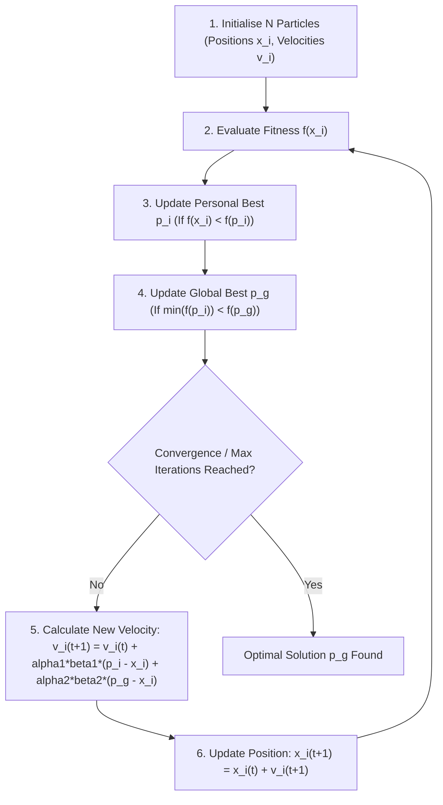
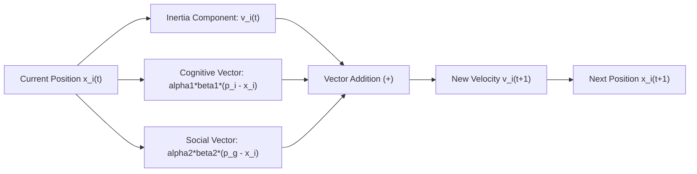
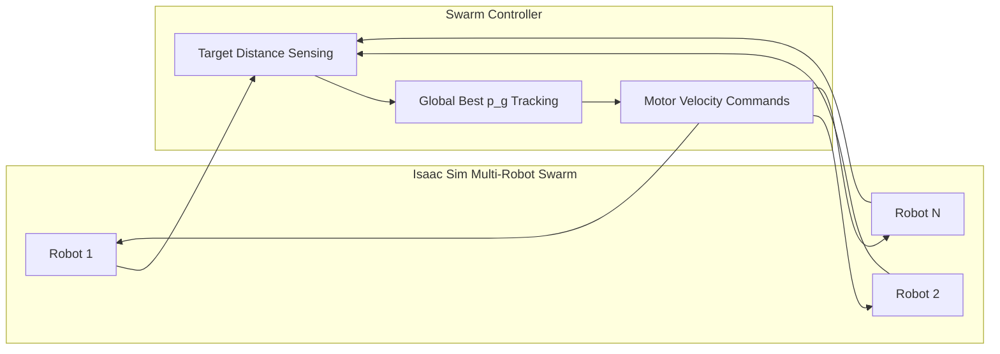

# Lab 4: EC (PSO)

## Particle swarm optimisation

### Objective

- develop a Python function to perform global best particle swarm optimisation
- explore NVIDIA Isaac Sim for particle swarm optimisation in robot swarm simulation

### Setup for Spyder

1. If you are using Spyder for this lab, go to <kbd>Tools</kbd> > <kbd>Preferences</kbd> > <kbd>IPython console</kbd> > <kbd>Graphics</kbd> and set <kbd>Backend</kbd> to <kbd>Automatic</kbd>.

2. Restart kernel by going to <kbd>Consoles</kbd> > <kbd>Restart kernel</kbd>.

### Problem to solve

Solve the following problem using global best particle swarm optimisation:

!!! abstract "Problem"
    Find the value of x to minimise the function $f(x) = (x+100)(x+50)(x)(x-20)(x-60)(x-100)$ for $-100 < x < 100$

### Particle swarm optimisation

<div class="timeline">
<div class="container right"><div class="content"><a href='#initialise-particles'>particles initialisation</a></div></div>
<div class="container right"><div class="content"><a href='#update-personal-best'>personal best identification</a></div></div>
<div class="container right"><div class="content"><a href="#update-global-best">global best identification</a></div></div>
<div class="container right"><div class="content"><a href="#update-velocity">velocity calculation</a></div></div>
<div class="container right"><div class="content"><a href="#update-particle-position">position update</a></div></div>
<div class="container right"><div class="content"><a href="#create-a-loop-until-termination">repeat from personal best identification until termination</a></div></div>
</div>



### Parameter definition

1. With global best particle swarm optimisaton, the position update function is given by

    $$x_i(t+1) = x_i(t) + v_i(t+1)$$

    and the velocity update function is

    $$v_i(t+1) = v_i(t) + \alpha_1\beta_1(t) \Big( p_i(t) - x_i(t) \Big) + \alpha_2\beta_2(t)\Big(p_g(t) - x_i(t)\Big)$$

2. &alpha;<sub>1</sub> and &alpha;<sub>2</sub> are acceleration constants that are fixed throughout the algorithm. Define a small value for &alpha;<sub>1</sub> and &alpha;<sub>2</sub>, for example `0.1`.



    ```python
    alpha = [0.1, 0.1]
    ```

3. &beta;<sub>1</sub>(t) and &beta;<sub>2</sub>(t) are random values between `0` and `1` that are regenerated every iteration. Therefore no definition is required.

4. Also, define the number of particles to run the algorithm with.

    ```python
    n_particle = 10
    ```

5. Place the definition of these variables in the `__main__` block.

    ```python
    if __name__ == '__main__':
      alpha = [0.1, 0.1]
      n_particle = 10
    ```

### Create a class for particle

1. As each particle is an individual, create a `Particle` class to hold the data of the particle's current position, velocity, and personal best position.

    ```python
    class Particle:
      def __init__(self, position = 0, velocity = 0):
        self.position = position
        self.velocity = velocity
        self.best_position = position
    ```

### Fitness function

1. Fitness function is how we can compare different particles.

2. As our goal is to minimise f(x) as stated in the [beginning](#problem-to-solve), we will use f(x) as our fitness function.

3. By using f(x) in minimisation problem, it implies that the lower the value of f(x), the better the particle it is.

4. The value of x is the position of the particle.

5. Define the fitness function as a Python function.

    ```python
    def fit_fcn(position):
      ...
      return fitness
    ```

### Initialise particles

1. Particles are initialised with random positions within the constraints. 

2. At initialisation, we may assume that the initial velocities of all the particles. It is possible to initialise particles with non-zero velocities. For now, we will stick to zero initial velocities.

3. Define a Python function that takes the input of the number of particles and the limits of the positions to initialise and return a list of objects of class `Particle`. Each particle has random position within the limits and zero velocity.

    ```python
    def initialise_particles(n_ptc, position_limits):
      # position_limits is a list of two values. The first value is the lower boundary and the second value is the upper boundary.
      ...
      return particles
    ```

4. Remember to test your function before proceed.

### Update personal best

1. Create a method in the class `Particle` to update the `best_position` if necessary.

    ```python
    class Particle:
      def __init__(...):
        ...

      def update_personal_best(self):
        # 1. calculate the fitnesses of the best_position and the particle's current position
        # 2. compare the fitnesses and determine if the current position is better than the best_position
        # 3. update if necessary
        # 4. no return statement is required
    ```

2. If the new position has a lower fitness, i.e. the new position is better than the best position, update the `best_position` to hold the value of the new position.

### Update global best

1. Initiate a variable named `global_best_position` with the value `None` in the `__main__` block. 

2. Create a function that takes two positions as inputs, compare them, and return the better position of the two.

    ```python
    def compareFitness(pos1, pos2):
      # 1. calculate the fitness of pos1 and pos2
      # 2. compare to determine the better position
      return betterpos
    ```

3. We will later use this function to compare the current global best position with the personal best position of each particle.

### Update velocity

1. Create a method in the class `Particle` to update the velocity given &alpha;<sub>1</sub>, &alpha;<sub>2</sub>, &beta;<sub>1</sub>, &beta;<sub>2</sub>, and the global best position.

    ```python
    class Particle:
      def __init__(...):
        ...

      def update_personal_best(...):
        ...

      def update_velocity(self, alpha, beta, glob_best_pos):
        # alpha is a list of two values. we will access alpha_1 and alpha_2 by alpha[0] and alpha[1] respectively. This also applies to beta.
        # the current position, current velocity, and personal best position of the particle can be accessed by self.position, self.velocity, and self.best_position
        # assign the particle's velocity with the updated velocity
    ```

### Update particle position

1. As updating a particle position only require information from within the particle object and the limits of the position, create a method called `update_position` in the class `Particle` taking the input of the limits of the position.

    ```python
    class Particle:
      def __init__(...):
        ...

      def update_personal_best(...):
        ...

      def update_velocity(...):
        ...

      def update_position(self, position_limits):
        self.position = self.position + self.velocity
        # how should you solve the problem of the position (x) going out of the limits
    ```

### Create a loop (until termination)

1. Consider the following termination criteria:
    - exceeding 200 iterations
    - fitnesses of all particles are close
    - positions of all particles are close

2. Create a function to calculate the average difference between the mean fitness and the fitness of each particle.

    ```python
    def calc_avg_fit_diff(particles):
      # 1. calculate mean fitness of all particles
      # 2. calculate the difference between the mean fitness and the fitness of each particle
      # 3. calculate the average of the differences obtained from step 2
      return avg_fit_diff
    ```

3. Create a function to calculate the average difference between the mean position and the position of each particle.

    ```python
    def calc_avg_pos_diff(particles):
      # 1. calculate mean position of all particles
      # 2. calculate the difference between the mean position and the position of each particle
      # 3. calculate the average of the differences obtained from step 2
      return avg_pos_diff
    ```

4. Create a loop (in the `__main__` block) to execute the global best particle swarm optimisation (gbest PSO) until termination. <span id="code-block-to-update"></span>

    ```python
    if __name__ == '__main__':
      # parameter initialisation
      alpha = [0.1, 0.1]
      n_particle = 10
      global_best_position = None
      position_limits = [-100, 100]
      # termination threshold
      iteration = 0
      max_iter = 200
      min_avg_fit_diff = 0.1
      min_avg_pos_diff = 0.1
      # initialise particles
      particles = initialise_particles(n_particle, position_limits)
      while (...): # how should you define the termination criteria here?
        print(iteration, [round(x.position,2) for x in particles])
        for particle in particles:
          # update personal best
          particle.update_personal_best()
          # update global best
          if global_best_position == None:
            global_best_position = particle.position
          else:
            global_best_position = compareFitness(global_best_position, particle.position)
        # generate beta randomly for current iteration
        beta = [random.random(), random.random()]
        for particle in particles:
          # update velocity
          particle.update_velocity(alpha, beta, global_best_position)
          # update position
          particle.update_position(position_limits)
        iteration += 1
      # display results
      print(iteration, [round(x.position,2) for x in particles])
    ```

### Visualisation

1. Let's add a few lines to visualise particles "flying" towards to optimal position.

    - import the visualisation library
      ```python
      import matplotlib.pyplot as plt
      ```
    
    - add the following lines just before the `while` loop in the [last code block in the previous section](#code-block-to-update).
      ```python
      space_ax = plt.axes()
      space_ax.plot(list(range(*position_limits)),[fit_fcn(x) for x in range(*position_limits)])
      space_ax.set_title("Position of particles in iteration {}".format(iteration))
      space_ax.set_xlabel("Position")
      space_ax.set_ylabel("Fitness")
      ```

    - add the following lines between line 14 and line 15 in the [last code block in the previous section](#code-block-to-update), as well as after line 33.
      ```python
      if len(space_ax.lines) > 1:
        space_ax.lines[1].remove()
      space_ax.plot([x.position for x in particles], [fit_fcn(x.position) for x in particles], 'go')
      space_ax.set_title("Position of particles in iteration {}".format(iteration))
      plt.pause(0.5) # pause the program for 0.5 second; if graph changes too quickly, increase this value; you can also speed up the process by decreasing this value
      ```

### Evaluation

1. Store the values of the variables at each iteration for analysis and evaluation.

    - position of each particle at each iteration (add the new line of code to the end of the methods)

      ```python
      class Particle:
        def __init__(...):
          ...
          self.position_list = [position]

        def update_position(...):
          ...
          self.position_list.append(self.position)
      ```

    - velocity of each particle at each iteration (add the new line of code to the end of the methods)

      ```python
      class Particle:
        def __init__(...):
          ...
          self.velocity_list = [velocity]

        def update_velocity(...):
          ...
          self.velocity_list.append(self.velocity)
      ```

    - personal best position of each particle at each iteration (add the new line of code to the end of the methods)

      ```python
      class Particle:
        def __init__(...):
          ...
          self.best_position_list = []

        def update_personal_best(...):
          ...
          self.best_position_list.append(self.best_position)
      ```

    - global best position at each iteration

      ```python
      if __init__ == '__main__':
        # parameter initialisation
        ...
        global_best_position_list = []
        ...
              global_best_position = ...
          global_best_position_list.append(global_best_position) # take note on the indentation
          # generate beta randomly for current iteration
          ...
      ```

3. Visualise the progression of these variables by adding the following code to the end of the `__main__` block.

    ```python
    [pos_fig, position_axes] = plt.subplots(4,1,sharex=True)
    position_axes[0].set_title("Position of each particle")
    position_axes[1].set_title("Fitness of each particle")
    position_axes[2].set_title("Boxplot of position at each iteration")
    position_axes[3].set_title("Boxplot of fitness at each iteration")
    position_axes[3].set_xlabel("Iteration")
    [vel_fig, velocity_axes] = plt.subplots(2,1,sharex=True)
    velocity_axes[0].set_title("Velocity of each particle")
    velocity_axes[1].set_title("Boxplot for velocity at each iteration")
    velocity_axes[1].set_xlabel("Iteration")
    [p_best_fig, personal_best_axes] = plt.subplots(4,1,sharex=True)
    personal_best_axes[0].set_title("Personal best position of each particle")
    personal_best_axes[1].set_title("Personal best fitness of each particle")
    personal_best_axes[2].set_title("Boxplot of personal best position at each iteration")
    personal_best_axes[3].set_title("Boxplot of personal best fitness at each iteration")
    personal_best_axes[3].set_xlabel("Iteration")
    [g_best_fig, global_best_axes] = plt.subplots(2,1,sharex=True)
    global_best_axes[0].set_title("Global best position")
    global_best_axes[1].set_title("Fitness for global best position")
    global_best_axes[1].set_xlabel("Iteration")
    for particle in particles:
      iteration_list = list(range(len(particle.position_list)))
      position_axes[0].plot(iteration_list, particle.position_list, '-o')
      position_axes[1].plot(iteration_list, [fit_fcn(x) for x in particle.position_list], '-o')

      velocity_axes[0].plot(iteration_list, particle.velocity_list, '-o')

      personal_best_axes[0].plot(iteration_list[:-1], particle.best_position_list, '-o')
      personal_best_axes[1].plot(iteration_list[:-1], [fit_fcn(x) for x in particle.best_position_list], '-o')

    position_axes[2].boxplot([[p.position_list[i] for p in particles] for i in iteration_list], positions=iteration_list)
    position_axes[3].boxplot([[fit_fcn(p.position_list[i]) for p in particles] for i in iteration_list], positions=iteration_list)

    velocity_axes[1].boxplot([[p.velocity_list[i] for p in particles] for i in iteration_list], positions=iteration_list)

    personal_best_axes[2].boxplot([[p.best_position_list[i] for p in particles] for i in iteration_list[:-1]], positions=iteration_list[:-1])
    personal_best_axes[3].boxplot([[fit_fcn(p.best_position_list[i]) for p in particles] for i in iteration_list[:-1]], positions=iteration_list[:-1])

    global_best_axes[0].plot(iteration_list[:-1], global_best_position_list, '-o')
    global_best_axes[1].plot(iteration_list[:-1], [fit_fcn(x) for x in global_best_position_list], '-o')
    ```

### Exercise

1. Multiply the velocity memory, $v_i(t)$, with a value between 0 and 1, let's say 0.5. How does the process change? This is the effect of inertia weight.

2. Reduce the value of $\alpha_1$ to 0.05 while maintaining $\alpha_2$ at 0.1 and investigate the effect. 

3. Reduce the value of $\alpha_1$ to 0. How does this affect the result?

4. Modify such that $\alpha_1$ is larger than $\alpha_2$. What's the effect?

### Optional

1. How may you modify the formulae for particles with two variables, in which the fitness function is defined as $f(x,y) = x^2 + y^2$? 

---

You can download the full Python script here: [lab4_pso.py](files/lab4_pso.py)

---


## Robot Swarm Simulation with NVIDIA Isaac Sim

Particle Swarm Optimisation (PSO) is widely used in robotics for multi-robot swarm target searching, signal source localization, and collaborative area exploration.

[NVIDIA Isaac Sim](https://developer.nvidia.com/isaac-sim) is a GPU-accelerated, photorealistic robotics simulator built on NVIDIA Omniverse. By combining PSO with Isaac Sim, physical mobile robots (acting as particles) can be simulated navigating through a 3D environment toward an optimal target location.

### Swarm Robotics Problem Setup

Consider a swarm of $N$ mobile robots deployed in a 3D environment. A target beacon (e.g. thermal source or radio signal emitter) is placed at coordinates $(x_{target}, y_{target})$.

1. **Fitness Function**: Each robot measures its distance to the target source at its current location $(x_i, y_i)$:
   $$f(x_i, y_i) = \sqrt{(x_i - x_{target})^2 + (y_i - y_{target})^2}$$
   The swarm's goal is to **minimise** $f(x_i, y_i)$.

2. **2D Physical Velocity Update**:
   $$v_{i,x}(t+1) = w \cdot v_{i,x}(t) + \alpha_1 \beta_1(t) \Big(p_{i,x}(t) - x_i(t)\Big) + \alpha_2 \beta_2(t) \Big(p_{g,x}(t) - x_i(t)\Big)$$
   $$v_{i,y}(t+1) = w \cdot v_{i,y}(t) + \alpha_1 \beta_1(t) \Big(p_{i,y}(t) - y_i(t)\Big) + \alpha_2 \beta_2(t) \Big(p_{g,y}(t) - y_i(t)\Big)$$

3. **Robot Control**: The 2D velocity vector $(v_{i,x}, v_{i,y})$ is set as physical linear velocity commands for the robot body inside Isaac Sim.

### Python Implementation in NVIDIA Isaac Sim

You can download the full Python script here: [isaac_pso_swarm.py](files/isaac_pso_swarm.py)

Below is the complete standalone Python implementation using Isaac Sim's Python Standalone API (`omni.isaac.core`):

```python
import numpy as np

# 1. Initialize NVIDIA Isaac Sim application
try:
    from isaacsim import SimulationApp
    simulation_app = SimulationApp({"headless": False})
except ImportError:
    from omni.isaac.kit import SimulationApp
    simulation_app = SimulationApp({"headless": False})

from omni.isaac.core import World
from omni.isaac.core.objects import DynamicSphere, VisualCuboid

class RobotParticle:
    """Class representing a physical robot particle in NVIDIA Isaac Sim."""
    def __init__(self, robot_id, initial_pos, world):
        self.id = robot_id
        self.position = np.array(initial_pos, dtype=np.float64) # [x, y, z]
        self.velocity = np.zeros(2, dtype=np.float64)           # [vx, vy]
        self.best_position = np.copy(self.position[:2])
        self.best_fitness = float('inf')
        
        # Spawn visual robot sphere in Isaac Sim arena
        self.prim = world.scene.add(
            DynamicSphere(
                prim_path=f"/World/Robot_{robot_id}",
                name=f"robot_{robot_id}",
                position=self.position,
                radius=0.3,
                color=np.array([0.1, 0.6, 0.9])
            )
        )

    def evaluate_fitness(self, target_pos):
        """Measure Euclidean distance to target beacon (fitness function)."""
        current_pos, _ = self.prim.get_world_pose()
        self.position[:2] = current_pos[:2]
        
        fitness = np.linalg.norm(self.position[:2] - target_pos[:2])
        if fitness < self.best_fitness:
            self.best_fitness = fitness
            self.best_position = np.copy(self.position[:2])
            
        return fitness

    def update_motion(self, alpha, beta, global_best_pos, max_speed=1.5):
        """Update PSO velocity and drive robot body in Isaac Sim."""
        r1, r2 = beta[0], beta[1]
        
        # 2D PSO velocity formula
        cognitive = alpha[0] * r1 * (self.best_position - self.position[:2])
        social = alpha[1] * r2 * (global_best_pos[:2] - self.position[:2])
        
        # Velocity update with inertia weight w=0.5
        self.velocity = 0.5 * self.velocity + cognitive + social
        
        # Speed limit constraint
        speed = np.linalg.norm(self.velocity)
        if speed > max_speed:
            self.velocity = (self.velocity / speed) * max_speed
            
        # Apply linear velocity to physical robot body in Isaac Sim
        linear_velocity = np.array([self.velocity[0], self.velocity[1], 0.0])
        self.prim.set_linear_velocity(linear_velocity)

def run_isaac_pso():
    # 2. Create Isaac Sim World
    world = World(stage_units_in_meters=1.0)
    world.scene.add_default_ground_plane()
    
    # Target beacon location (Global Best Goal)
    target_pos = np.array([10.0, 10.0, 0.5])
    world.scene.add(
        VisualCuboid(
            prim_path="/World/TargetBeacon",
            name="target_beacon",
            position=target_pos,
            scale=np.array([0.6, 0.6, 1.0]),
            color=np.array([1.0, 0.0, 0.0]) # Red beacon
        )
    )
    
    # 3. Parameters Initialization
    n_robots = 10
    alpha = [0.15, 0.2]
    position_bounds = [-15.0, 15.0]
    
    # Initialize robot swarm randomly within position bounds
    robots = []
    for i in range(n_robots):
        init_x = np.random.uniform(position_bounds[0], position_bounds[1])
        init_y = np.random.uniform(position_bounds[0], position_bounds[1])
        init_pos = [init_x, init_y, 0.3]
        robots.append(RobotParticle(i, init_pos, world))
        
    world.reset()
    global_best_pos = None
    global_best_fitness = float('inf')
    
    print("--- Starting NVIDIA Isaac Sim Robot Swarm PSO Simulation ---")
    
    # 4. Main Simulation & Optimisation Loop
    iteration = 0
    max_iterations = 200
    
    while simulation_app.is_running() and iteration < max_iterations:
        world.step(render=True)
        
        # Step A: Evaluate fitness for each robot
        for robot in robots:
            fitness = robot.evaluate_fitness(target_pos)
            if fitness < global_best_fitness:
                global_best_fitness = fitness
                global_best_pos = np.copy(robot.position[:2])
                
        # Step B: Generate random beta for current iteration
        beta = [np.random.random(), np.random.random()]
        
        # Step C: Update velocities and move robots
        for robot in robots:
            robot.update_motion(alpha, beta, global_best_pos)
            
        if iteration % 20 == 0:
            print(f"Iteration {iteration}: Swarm Global Best Distance = {global_best_fitness:.3f} m")
            
        iteration += 1

    print(f"Convergence achieved! Target reached at {global_best_pos}")
    simulation_app.close()

if __name__ == "__main__":
    run_isaac_pso()
```

### Key Differences: Mathematical vs Physical Swarm PSO



!!! tip "Robotics PSO Considerations"
    1. **Dynamics & Speed Limits**: Mathematical particles can change speed instantaneously. Physical robots have motor limits, inertia, and maximum speeds ($v_{max}$).
    2. **Sensor Noise**: Real robot sensor measurements (e.g. distance or light intensity) contain noise, so fitness updates often require moving averages or Kalman filtering.
    3. **Collision Avoidance**: In real swarm robotics, repulsive potential fields or obstacle avoidance algorithms are integrated into velocity calculations to prevent physical robot collisions.

---

<footer style="text-align: center; margin-top: 2em; opacity: 0.8; font-size: 0.85em;">
Copyright Author: Dr Tang Tiong Yew
</footer>
