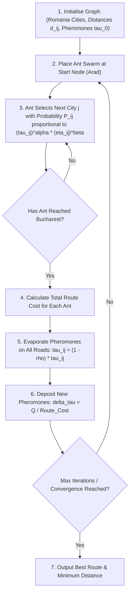
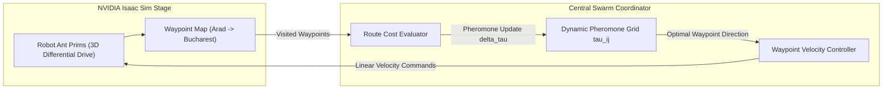

# Lab 5: EC (ACO)

## Ant colony optimisation

### Objective

- to develop a Python function to perform ant colony optimisation on a problem
- explore NVIDIA Isaac Sim for ant colony optimisation in robot swarm route finding

### Problem to solve

We will use ant colony optimisation to solve the Nick's route-finding problem in Romania. The problem is a route finding problem to identify the best (cheapest) route to travel from Arad to Bucharest.



The road map of Romania is provided as follows:

<div>
<div id="romania">
<svg viewBox="0 0 950 500">

<path d="M 75 125 L 100 75" stroke="black" />
<text :x="(75+100)/2" :y="(125+75)/2" text-anchor="end">75</text>
<path d="M 100 75 L 125 25" stroke="black" />
<text :x="(100+125)/2" :y="(75+25)/2" text-anchor="end">71</text>
<path d="M 125 25 L 265 175" stroke="black" />
<text :x="(125+265)/2" :y="(25+175)/2-10" text-anchor="start">151</text>
<path d="M 265 175 L 75 125" stroke="black" />
<text :x="(265+75)/2" :y="(175+125)/2+15" text-anchor="end">140</text>
<path d="M 75 125 L 85 280" stroke="black" />
<text :x="(75+85)/2-5" :y="(125+280)/2" text-anchor="end">118</text>
<path d="M 85 280 L 185 335" stroke="black" />
<text :x="(85+185)/2+5" :y="(280+335)/2-5" text-anchor="start">111</text>
<path d="M 185 335 L 190 390" stroke="black" />
<text :x="(185+190)/2+10" :y="(335+390)/2" text-anchor="start">70</text>
<path d="M 190 390 L 185 450" stroke="black" />
<text :x="(190+185)/2+10" :y="(390+450)/2" text-anchor="start">75</text>
<path d="M 185 450 L 350 465" stroke="black" />
<text :x="(185+350)/2" :y="(450+465)/2-10" text-anchor="end">120</text>
<path d="M 350 465 L 320 230" stroke="black" />
<text :x="(350+320)/2-10" :y="(465+230)/2" text-anchor="end">146</text>
<path d="M 320 230 L 265 175" stroke="black" />
<text :x="(320+265)/2+5" :y="(230+175)/2" text-anchor="start">80</text>
<path d="M 265 175 L 425 175" stroke="black" />
<text :x="(265+425)/2" :y="(175+175)/2-5" text-anchor="middle">99</text>
<path d="M 320 230 L 475 310" stroke="black" />
<text :x="(320+475)/2" :y="(230+310)/2-5" text-anchor="start">97</text>
<path d="M 475 310 L 350 465" stroke="black" />
<text :x="(475+350)/2-5" :y="(310+465)/2-5" text-anchor="end">138</text>
<path d="M 475 310 L 640 390" stroke="black" />
<text :x="(475+640)/2-10" :y="(310+390)/2+10" text-anchor="end">101</text>
<path d="M 425 175 L 640 390" stroke="black" />
<text :x="(425+640)/2+5" :y="(175+390)/2-5" text-anchor="start">211</text>
<path d="M 640 390 L 575 485" stroke="black" />
<text :x="(640+575)/2-5" :y="(390+485)/2" text-anchor="end">90</text>
<path d="M 640 390 L 745 340 " stroke="black" />
<text :x="(640+745)/2-5" :y="(390+340)/2" text-anchor="end">85</text>
<path d="M 745 340 L 875 340" stroke="black" />
<text :x="(745+875)/2" :y="(340+340)/2+15" text-anchor="middle">98</text>
<path d="M 875 340 L 935 440" stroke="black" />
<text :x="(875+935)/2-10" :y="(340+440)/2+5" text-anchor="end">86</text>
<path d="M 745 340 L 850 225" stroke="black" />
<text :x="(745+850)/2-5" :y="(340+225)/2-5" text-anchor="end">142</text>
<path d="M 850 225 L 760 120" stroke="black" />
<text :x="(850+760)/2+5" :y="(225+120)/2" text-anchor="start">92</text>
<path d="M 760 120 L 625 60" stroke="black" />
<text :x="(760+625)/2+5" :y="(120+60)/2-5" text-anchor="start">87</text>

<circle cx="75" cy="125" r="10" fill="green" />
<text x="60" y="130" text-anchor="end">Arad</text>
<circle cx="100" cy="75" r="10" fill="gray" />
<text x="85" y="75" text-anchor="end">Zerind</text>
<circle cx="125" cy="25" r="10" fill="gray" />
<text x="110" y="20" text-anchor="end">Oradea</text>
<circle cx="265" cy="175" r="10" fill="gray" />
<text x="265" y="160" text-anchor="start">Sibiu</text>
<circle cx="425" cy="175" r="10" fill="gray" />
<text x="440" y="180" text-anchor="start">Fagaras</text>
<circle cx="320" cy="230" r="10" fill="gray" />
<text x="305" y="235" text-anchor="end">Rimnicu Vilcea</text>
<circle cx="475" cy="310" r="10" fill="gray" />
<text x="460" y="320" text-anchor="end">Pitesti</text>
<circle cx="350" cy="465" r="10" fill="gray" />
<text x="340" y="480" text-anchor="end">Craiova</text>
<circle cx="185" cy="450" r="10" fill="gray" />
<text x="170" y="455" text-anchor="end">Drobeta</text>
<circle cx="190" cy="390" r="10" fill="gray" />
<text x="175" y="395" text-anchor="end">Mehadia</text>
<circle cx="185" cy="335" r="10" fill="gray" />
<text x="170" y="345" text-anchor="end">Lugoj</text>
<circle cx="85" cy="280" r="10" fill="gray" />
<text x="70" y="285" text-anchor="end">Timisoara</text>
<circle cx="640" cy="390" r="10" fill="red" />
<text x="625" y="400" text-anchor="end">Bucharest</text>
<circle cx="575" cy="485" r="10" fill="gray" />
<text x="560" y="490" text-anchor="end">Giurgiu</text>
<circle cx="745" cy="340" r="10" fill="gray" />
<text x="730" y="335" text-anchor="end">Urziceni</text>
<circle cx="875" cy="340" r="10" fill="gray" />
<text x="875" y="325" text-anchor="end">Hirsova</text>
<circle cx="935" cy="440" r="10" fill="gray" />
<text x="920" y="445" text-anchor="end">Eforie</text>
<circle cx="850" cy="225" r="10" fill="gray" />
<text x="835" y="230" text-anchor="end">Vaslui</text>
<circle cx="760" cy="120" r="10" fill="gray" />
<text x="745" y="135" text-anchor="end">Iasi</text>
<circle cx="625" cy="60" r="10" fill="gray" />
<text x="610" y="65" text-anchor="end">Neamt</text>
</svg>
</div>
<script src="https://cdn.jsdelivr.net/npm/vue@2/dist/vue.js"></script>
<script>new Vue({ el: "#romania" });</script>
</div>

### Problem formulation
1. The coordinates of each town are provided as follows. This will be used later for the purpose of visualisation.

    ```python
    location_list = [ # [x,y,name]
      [75, 125, 'Arad'],
      [100, 75, 'Zerind'],
      [125, 25, 'Oradea'],
      [265, 175, 'Sibiu'],
      [425, 175, 'Fagaras'],
      [320, 230, 'Rimnicu Vilcea'],
      [475, 310, 'Pitesti'],
      [350, 465, 'Craiova'],
      [185, 450, 'Drobeta'],
      [190, 390, 'Mehadia'],
      [185, 335, 'Lugoj'],
      [85, 280, 'Timisoara'],
      [640, 390, 'Bucharest'],
      [575, 485, 'Giurgiu'],
      [745, 340, 'Urziceni'],
      [875, 340, 'Hirsova'],
      [935, 440, 'Eforie'],
      [850, 225, 'Vaslui'],
      [760, 120, 'Iasi'],
      [625, 60, 'Neamt']
    ]
    ```

2. Then define the travel cost between connected cities. 

    ```python
    step_cost = [
      ['Arad', 'Zerind', 75],
      ['Zerind', 'Oradea', 71],
      ['Oradea', 'Sibiu', 151],
      ['Sibiu', 'Arad', 140],
      ['Sibiu', 'Fagaras', 99],
      ['Sibiu', 'Rimnicu Vilcea', 80],
      ['Fagaras', 'Bucharest', 211],
      ['Bucharest', 'Giurgiu', 90],
      ['Bucharest', 'Pitesti', 101],
      ['Pitesti', 'Rimnicu Vilcea', 97],
      ['Rimnicu Vilcea', 'Craiova', 146],
      ['Craiova', 'Pitesti', 138],
      ['Craiova', 'Drobeta', 120],
      ['Drobeta', 'Mehadia', 75],
      ['Mehadia', 'Lugoj', 70],
      ['Lugoj', 'Timisoara', 111],
      ['Arad', 'Timisoara', 118],
      ['Bucharest', 'Urziceni', 85],
      ['Urziceni', 'Vaslui', 142],
      ['Vaslui', 'Iasi', 92],
      ['Iasi', 'Neamt', 87],
      ['Urziceni', 'Hirsova', 98],
      ['Hirsova', 'Eforie', 86]
    ]
    ```

3. We will define two class, `City` and `Road`.

4. An object of class `City` has the attributes of `name` (the name of the city), `roads` (an array of references to the roads connected to the current city), and `coordinates` (coordinates of the cities).

    ```python
    class City:
      def __init__(self, name):
        self.name = name
        self.roads = []
        self.coordinates = []
        
      def set_coordinates(self, coordinates):
        self.coordinates = coordinates

      def add_road(self, road):
        if road not in self.roads:
          self.roads.append(road)
    ```

5. An object of class `Road` has the attributes of `connected_cities` (an array of references to the cities connected through this road), `cost` (the step cost of this road), and `pheromone` (the pheromone on this road).

    ```python
    class Road:
      def __init__(self, connected_cities, cost, pheromone=0):
        self.connected_cities = connected_cities
        self.cost = cost
        self.pheromone = pheromone
    ```

6. We will construct the list of `City` objects and `Road` objects from the information provided by the question, i.e. information in `location_list` and `step_cost`. The following code block should be in the `main` code block.

    ```python
    cities = {}
    for coord1, coord2, name in location_list:
      cities[name] = City(name)
      cities[name].set_coordinates([coord1, coord2])
    roads = []
    for city1, city2, cost in step_cost:
      road = Road([cities[city1], cities[city2]], cost)
      cities[city1].add_road(road)
      cities[city2].add_road(road)
      roads.append(road)
    ```

7. In the `main` code block, define the `origin` and `destination` cities.

    ```python
    origin = cities['Arad']
    destination = cities['Bucharest']
    ```

### Initiating ACO algorithm

1. We then define the parameters for ACO, i.e. number of ants, `n_ant`, pheromone influence constant, `alpha`, and evaporation rate, `rho`.

    ```python
    n_ant = 10
    alpha = 1
    rho = 0.1
    ```

2. Add the method `set_pheromone` to the class `Road`. 
    ```python
    class Road:
      def __init__(...):
        ...

      def set_pheromone(self, pheromone):
        self.pheromone = pheromone
    ```

3. Set the initial pheromone of each road to 0.01.
    ```python
    # in main block
    initial_pheromone = 0.01
    for road in roads:
      road.set_pheromone(initial_pheromone)
    ```

4. Define the class `Ant`. 
    ```python
    class Ant:
      def __init__(self):
        self.cities = [] # cities the ant passes through, in sequence
        self.path = [] # roads the ant uses, in sequence
    ```

5. Initiate `n_ants` ants.
    ```python
    ants = [Ant() for _ in range(n_ant)]
    ```

### Identify path of each ant
1. In the `Ant` class, define a method to identify the path by taking the inputs of the available roads, the origin, the destination, and the pheromone influence constant &alpha;.

    ```python
    class Ant:
      def __init__(...):
        ...

      def get_path(self, origin, destination, alpha):
        # 1. append origin to the self.cities
        # 2. if the last city is not destination, search for the next city to go
        # 3. after getting to the destination, remove the loop within the path, i.e. if there are repeated cities in self.cities, remove the cities and the roads in between the repetition
    ```

2. Define a method to calculate the path length.

    ```python
    class Ant:
      def __init__(...):
        ...

      def get_path(...):
        ...

      def get_path_length(self):
        # calculate path length based on self.path
        return path_length
    ```

3. As the path of each ant will be reset every iteration, define a method that reset the `path` and `cities`.

    ```python
    class Ant:
      def __init__(...):
        ...
      
      def get_path(...):
        ...

      def get_path_length(...):
        ...

      def reset(self):
        self.path = []
        self.cities = []
    ```

### Evaporation
1. In the `Road` class, define a method to evaporate the pheromone by taking the input of evaporation rate &rho;.

    ```python
    class Road:
      def __init__(...):
        ...
      
      def set_pheromone(...):
        ...

      def evaporate_pheromone(self, rho):
        # update the pheromone of the road
    ```

### Deposition
1. In the `Road` class, define a method to calculate the updated pheromone after pheromone deposition by taking the input of all the ants. We will use the following pheromone deposition formula for ant $k$ on road $i$:

    $$\Delta\tau_{i,k} = \frac{1}{L_k}$$

    ```python
    class Road:
      def __init__(...):
        ...

      def set_pheromone(...):
        ...

      def evaporate_pheromone(...):
        ...

      def deposit_pheromone(self, ants):
        # 1. search for ants that uses the raod
        # 2. deposit pheromone using the inversely proportionate relationship between path length and deposited pheromone
    ```

### Termination conditions
1. We will use the following conditions as the termination conditions:
    - maximum iteration of 200
    - if &GreaterEqual;90% of the ants use the same path

2. Define a function to calculate the percentage of the most dominant path.

    ```python
    def get_percentage_of_dominant_path(ants):
      ...
      return percentage
    ```

### Loop until termination
1. Create a loop to iterate until termination.

    ```python
    # termination threshold
    max_iteration = 200
    percentage_of_dominant_path = 0.9
    
    iteration = 0
    while ...: # termination conditions
      # loop through all the ants to identify the path of each ant
      for ant in ants:
        # reset the path of the ant
        ant.reset()
        # identify the path of the ant
        ant.get_path(origin, destination, alpha)
      # loop through all roads
      for road in roads:
        # evaporate the pheromone on the road
        road.evaporate_pheromone(rho)
        # deposit the pheromone
        road.deposit_pheromone(ants)
      # increase iteration count
      iteration += 1
    # after exiting the loop, return the most occurred path as the solution
    ...
    ```

### Visualisation
1. Define the following functions:

    ```python
    import matplotlib.pyplot as plt
    ...
    def create_graph(cities):
      fig = plt.figure()
      ax = fig.add_subplot(1,1,1)
      cities_x = [city.coordinates[0] for key, city in cities.items()]
      cities_y = [city.coordinates[1] for key, city in cities.items()]
      ax.scatter(cities_x, cities_y)
      ax.set_aspect(aspect=1.0)
      return ax
    ```

    ```python
    def draw_pheromone(ax, roads):
      lines = []
      for road in roads:
        from_coord = road.connected_cities[0].coordinates
        to_coord = road.connected_cities[1].coordinates
        coord_x = [from_coord[0], to_coord[0]]
        coord_y = [from_coord[1], to_coord[1]]
        lines.append(ax.plot(coord_x, coord_y, c='k', linewidth=road.pheromone**2))
      return lines
    ```

2. Add the following lines to the `main` code block just before the `while` loop (loop until termination).

    ```python
    ax = create_graph(cities)
    lines = draw_pheromone(ax, roads)
    ```

3. Add the following lines to after `iteration += 1`.

    ```python
    # visualise
    for l in lines:
      del l
    lines = draw_pheromone(ax, roads)
    plt.pause(0.05)
    ```

### Evaluate effect of parameters
1. Modify the pheromone depositing formula to

    $$\Delta\tau_{i,k} = \frac{1}{L_k^{1.5}}$$

    What is the effect of this?

2. Modify the pheromone depositing formula to

    $$\Delta\tau_{i,k} = \frac{5}{L_k}$$

    What is the effect of this?

3. Investigate the effect of number of ants `n_ant`.

4. Investigate the effect of pheromone influence constant $\alpha$ `alpha`.

5. Investigate the effect of evaporation rate $\rho$ `rho`.

---

You can download the full Python script here: [lab5_aco.py](files/lab5_aco.py)

---


## NVIDIA Isaac Sim Example: ACO Robot Swarm Route Finding

In real-world swarm robotics and physical logistics, ant colony optimisation (ACO) can be deployed in simulated 3D environments (such as NVIDIA Isaac Sim) to guide autonomous robot swarms navigating complex waypoint graphs or warehouse road networks.

### Swarm Navigation Problem Setup

Consider a swarm of $N$ mobile robot ants deployed in a 3D environment with graph nodes representing physical waypoints (e.g., cities or storage hubs on the Romania map roadmap):

1. **Graph Waypoints & Pheromones**: Each road connecting two city waypoints $(i, j)$ carries a physical/virtual pheromone density $\tau_{ij}$. The distance cost $d_{ij}$ represents the physical road length.

2. **Probabilistic Route Building**: Each robot ant at city $i$ probabilistically selects its next connected unvisited waypoint $j$ based on:
   $$P_{ij} = \frac{\tau_{ij}^\alpha \cdot \eta_{ij}^\beta}{\sum_{k \in \text{unvisited}} \tau_{ik}^\alpha \cdot \eta_{ik}^\beta}$$
   where $\eta_{ij} = \frac{1}{d_{ij}}$ is the heuristic visibility (inverse distance).

3. **Physics & Pheromone Update**: As robot ants complete routes from origin (Arad) to destination (Bucharest), pheromone evaporates ($\tau_{ij} \leftarrow (1 - \rho)\tau_{ij}$) and ants deposit new pheromone proportional to route quality ($\Delta \tau_{ij} = \frac{Q}{L_k}$).

---

### Python Implementation in NVIDIA Isaac Sim

You can download the full Python script here: [isaac_aco_route.py](files/isaac_aco_route.py)

Below is the complete standalone Python implementation using Isaac Sim's Python Standalone API (`omni.isaac.core`) with a fallback mode for standard Python environments:

```python
"""
Ant Colony Optimisation (ACO) for Robot Swarm Route Finding in NVIDIA Isaac Sim
================================================================================
This script demonstrates multi-robot route finding and swarm path planning
using Ant Colony Optimisation on a map of connected waypoints (Romania Roadmap).

Execution Modes:
1. NVIDIA Isaac Sim Mode (Full 3D GPU physics & visual simulation):
   Run with Isaac Sim's standalone python:
   `isaac-sim.standalone.bat python src/files/isaac_aco_route.py`
   OR `python.bat src/files/isaac_aco_route.py`

2. Matplotlib Fallback Mode (Standard Python 2D/3D graph visualization):
   `python src/files/isaac_aco_route.py`
"""

import sys
import time
import numpy as np

# Try importing NVIDIA Isaac Sim modules
HAS_ISAAC_SIM = False
try:
    from isaacsim import SimulationApp
    HAS_ISAAC_SIM = True
except ImportError:
    try:
        from omni.isaac.kit import SimulationApp
        HAS_ISAAC_SIM = True
    except ImportError:
        HAS_ISAAC_SIM = False


# =====================================================================
# Romania Map Topology & ACO Data Structure
# =====================================================================
LOCATION_LIST = [  # [x, y, name]
    [75, 125, 'Arad'],
    [100, 75, 'Zerind'],
    [125, 25, 'Oradea'],
    [265, 175, 'Sibiu'],
    [425, 175, 'Fagaras'],
    [320, 230, 'Rimnicu Vilcea'],
    [475, 310, 'Pitesti'],
    [350, 465, 'Craiova'],
    [185, 450, 'Drobeta'],
    [190, 390, 'Mehadia'],
    [185, 335, 'Lugoj'],
    [85, 280, 'Timisoara'],
    [640, 390, 'Bucharest'],
    [575, 485, 'Giurgiu'],
    [745, 340, 'Urziceni'],
    [875, 340, 'Hirsova'],
    [935, 440, 'Eforie'],
    [850, 225, 'Vaslui'],
    [760, 120, 'Iasi'],
    [625, 60, 'Neamt']
]

STEP_COST = [
    ['Arad', 'Zerind', 75],
    ['Zerind', 'Oradea', 71],
    ['Oradea', 'Sibiu', 151],
    ['Sibiu', 'Arad', 140],
    ['Sibiu', 'Fagaras', 99],
    ['Sibiu', 'Rimnicu Vilcea', 80],
    ['Fagaras', 'Bucharest', 211],
    ['Bucharest', 'Giurgiu', 90],
    ['Bucharest', 'Pitesti', 101],
    ['Pitesti', 'Rimnicu Vilcea', 97],
    ['Rimnicu Vilcea', 'Craiova', 146],
    ['Craiova', 'Pitesti', 138],
    ['Craiova', 'Drobeta', 120],
    ['Drobeta', 'Mehadia', 75],
    ['Mehadia', 'Lugoj', 70],
    ['Lugoj', 'Timisoara', 111],
    ['Arad', 'Timisoara', 118],
    ['Bucharest', 'Urziceni', 85],
    ['Urziceni', 'Vaslui', 142],
    ['Vaslui', 'Iasi', 92],
    ['Iasi', 'Neamt', 87],
    ['Urziceni', 'Hirsova', 98],
    ['Hirsova', 'Eforie', 86]
]


class CityNode:
    """Represents a city node in the road network."""
    def __init__(self, name, x, y):
        self.name = name
        self.x = float(x)
        self.y = float(y)
        self.roads = []

    def add_road(self, road):
        if road not in self.roads:
            self.roads.append(road)


class RoadEdge:
    """Represents a connected road between two cities with distance cost & pheromone."""
    def __init__(self, city1, city2, cost, initial_pheromone=0.05):
        self.city1 = city1
        self.city2 = city2
        self.cost = float(cost)
        self.pheromone = float(initial_pheromone)

    def get_other_city(self, city):
        return self.city2 if city == self.city1 else self.city1

    def evaporate(self, rho):
        self.pheromone = (1.0 - rho) * self.pheromone

    def deposit(self, amount):
        self.pheromone += amount


class RobotAnt:
    """Simulated Ant Agent navigating through the graph."""
    def __init__(self, start_city):
        self.start_city = start_city
        self.current_city = start_city
        self.visited_cities = [start_city]
        self.path_roads = []

    def reset(self):
        self.current_city = self.start_city
        self.visited_cities = [self.start_city]
        self.path_roads = []

    def select_next_road(self, destination, alpha=1.0, beta=2.0):
        if self.current_city == destination:
            return None

        valid_roads = []
        probabilities = []

        for road in self.current_city.roads:
            next_city = road.get_other_city(self.current_city)
            if next_city not in self.visited_cities:
                valid_roads.append(road)
                # ACO transition rule: P ~ (tau^alpha) * (eta^beta)
                tau = road.pheromone ** alpha
                eta = (1.0 / road.cost) ** beta
                probabilities.append(tau * eta)

        if not valid_roads:
            return None  # Dead end

        prob_sum = sum(probabilities)
        if prob_sum == 0:
            probs = [1.0 / len(valid_roads)] * len(valid_roads)
        else:
            probs = [p / prob_sum for p in probabilities]

        chosen_road = np.random.choice(valid_roads, p=probs)
        return chosen_road

    def build_route(self, destination, alpha=1.0, beta=2.0, max_steps=30):
        self.reset()
        steps = 0
        while self.current_city != destination and steps < max_steps:
            road = self.select_next_road(destination, alpha, beta)
            if road is None:
                break  # Stuck or reached end
            next_city = road.get_other_city(self.current_city)
            self.path_roads.append(road)
            self.visited_cities.append(next_city)
            self.current_city = next_city
            steps += 1

        return self.current_city == destination

    def get_route_cost(self):
        return sum(road.cost for road in self.path_roads)


def build_network():
    cities = {name: CityNode(name, x, y) for x, y, name in LOCATION_LIST}
    roads = []
    for city1_name, city2_name, cost in STEP_COST:
        c1 = cities[city1_name]
        c2 = cities[city2_name]
        r = RoadEdge(c1, c2, cost)
        c1.add_road(r)
        c2.add_road(r)
        roads.append(r)
    return cities, roads


# =====================================================================
# 1. NVIDIA Isaac Sim Implementation
# =====================================================================
def run_isaac_sim_aco(n_ants=10, max_iterations=50, alpha=1.0, beta=2.0, rho=0.1):
    """Executes ACO Swarm Route Finding inside NVIDIA Isaac Sim photorealistic environment."""
    from isaacsim import SimulationApp
    simulation_app = SimulationApp({"headless": False})

    from omni.isaac.core import World
    from omni.isaac.core.objects import DynamicSphere, VisualSphere

    world = World(stage_units_in_meters=1.0)
    world.scene.add_default_ground_plane()

    cities, roads = build_network()
    origin = cities['Arad']
    destination = cities['Bucharest']

    # Scale 2D coordinates to 3D Isaac Sim world coords (-10m to 10m range)
    def to_isaac_coord(city):
        x_m = -8.0 + (city.x - 75.0) / (935.0 - 75.0) * 16.0
        y_m = 8.0 - (city.y - 25.0) / (485.0 - 25.0) * 16.0
        return np.array([x_m, y_m, 0.2])

    # Spawn city node markers in Isaac Sim
    for name, city in cities.items():
        pos = to_isaac_coord(city)
        color = np.array([0.1, 0.8, 0.1]) if name == 'Arad' else (
            np.array([0.9, 0.1, 0.1]) if name == 'Bucharest' else np.array([0.6, 0.6, 0.6])
        )
        radius = 0.5 if name in ['Arad', 'Bucharest'] else 0.35
        world.scene.add(
            VisualSphere(
                prim_path=f"/World/Cities/{name}",
                name=f"city_{name}",
                position=pos,
                radius=radius,
                color=color
            )
        )

    # Create physical ant robots
    ant_prims = []
    for i in range(n_ants):
        start_pos = to_isaac_coord(origin) + np.random.uniform(-0.2, 0.2, size=3)
        start_pos[2] = 0.25
        ant_prim = world.scene.add(
            DynamicSphere(
                prim_path=f"/World/Ants/Ant_{i}",
                name=f"ant_robot_{i}",
                position=start_pos,
                radius=0.2,
                color=np.array([0.9, 0.6, 0.1])  # Amber color for ants
            )
        )
        ant_prims.append(ant_prim)

    ants = [RobotAnt(origin) for _ in range(n_ants)]
    ant_wp_indices = [1] * n_ants  # Track target waypoint index along best route for each ant robot
    world.reset()

    print("=======================================================")
    print(" Running NVIDIA Isaac Sim Robot Swarm ACO Simulation   ")
    print("=======================================================")

    best_route_names = None
    best_route_cost = float('inf')

    for iteration in range(max_iterations):
        if not simulation_app.is_running():
            break

        world.step(render=True)

        # 1. Build route for all ant robots
        successful_ants = []
        for ant in ants:
            reached = ant.build_route(destination, alpha=alpha, beta=beta)
            if reached:
                successful_ants.append(ant)
                cost = ant.get_route_cost()
                if cost < best_route_cost:
                    best_route_cost = cost
                    best_route_names = [c.name for c in ant.visited_cities]

        # 2. Pheromone Evaporation
        for road in roads:
            road.evaporate(rho)

        # 3. Pheromone Deposition
        for ant in successful_ants:
            cost = ant.get_route_cost()
            delta_tau = 100.0 / cost
            for road in ant.path_roads:
                road.deposit(delta_tau)

        # 4. Move Isaac Sim Robot Prims along the best path for visualization
        if best_route_names and len(best_route_names) > 1:
            for idx, ant_prim in enumerate(ant_prims):
                wp_idx = ant_wp_indices[idx]
                target_city_name = best_route_names[min(wp_idx, len(best_route_names) - 1)]
                target_city = cities[target_city_name]
                target_pos = to_isaac_coord(target_city)
                current_pos, _ = ant_prim.get_world_pose()
                direction = target_pos[:2] - current_pos[:2]
                dist = np.linalg.norm(direction)

                if dist < 0.3:
                    if wp_idx + 1 < len(best_route_names):
                        ant_wp_indices[idx] += 1
                    else:
                        # Reached destination city! Reset position back to origin to loop route
                        reset_pos = to_isaac_coord(origin) + np.random.uniform(-0.2, 0.2, size=3)
                        reset_pos[2] = 0.25
                        ant_prim.set_world_pose(position=reset_pos)
                        ant_wp_indices[idx] = 1
                else:
                    vel = (direction / dist) * 1.5
                    ant_prim.set_linear_velocity(np.array([vel[0], vel[1], 0.0]))

        if iteration % 5 == 0 or iteration == max_iterations - 1:
            print(f"Iteration {iteration:02d} | Successful Ants: {len(successful_ants)}/{n_ants} | "
                  f"Best Route Cost: {best_route_cost:.1f} km | Route: {' -> '.join(best_route_names or [])}")

    print(f"\nConvergence achieved! Best Route Cost = {best_route_cost:.1f} km")
    simulation_app.close()
```

---

### Key Differences: Discrete Graph ACO vs Physical Robot Navigation



!!! tip "Robotic Pathfinding Considerations"
    1. **Waypoint Navigation & Kinematics**: In 3D physics simulation, physical robots move along continuous trajectories between waypoints, requiring differential drive velocity control instead of instant teleports.
    2. **Dynamic Pheromone Decay**: In physical environments, virtual pheromone maps can be maintained in a central swarm coordinator or shared via local inter-robot mesh communication.
    3. **Obstacle & Traffic Management**: Real robot swarms combine ACO macro-route planning with dynamic local collision avoidance (e.g. LiDAR or ORCA) to avoid bottlenecks at heavily populated waypoint intersections.

---

<footer style="text-align: center; margin-top: 2em; opacity: 0.8; font-size: 0.85em;">
Copyright Author: Dr Tang Tiong Yew
</footer>
