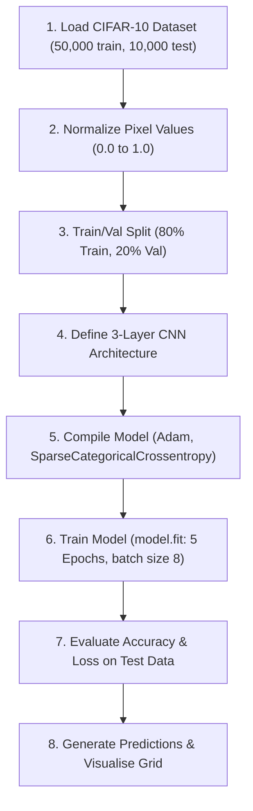

# Lab 8a: ANN using Keras
## Image Classification Using Keras

We are using Tensorflow for this lab. Install it using: `pip install tensorflow`


The libraries used in this lab:
```python
import tensorflow as tf
from tensorflow.keras import layers, models
from sklearn.model_selection import train_test_split
import numpy as np
import matplotlib.pyplot as plt
```

This section will go through how to build and train a simple image classification model using Keras.



### Load and Preprocess Data

We’ll use the [CIFAR-10 dataset](https://keras.io/api/datasets/cifar10/), which is included in Keras. Load the dataset into the training and testing sets using the code below.

```python
(train_images, train_labels), (test_images, test_labels) = tf.keras.datasets.cifar10.load_data()
```

Normalize data by scaling pixel values to be between 0 and 1. There are several benefits to normalizing data, with the most important being that it prevents any specific range of values from dominating the learning process.

```python
train_images, test_images = train_images / 255.0, test_images / 255.0
```

Split the training data into training and validation sets.

```python
train_images, val_images, train_labels, val_labels = train_test_split(
    train_images, train_labels, test_size=0.2, random_state=42
)
```

Let's define label for data visualization. The class label is not used during training. It is simply a name that indicates what the class number represents.

```python
class_names = ['airplane', 'automobile', 'bird', 'cat', 'deer', 'dog', 'frog', 'horse', 'ship', 'truck']
```

Plot some of the images to see how the data look like.

```python
plt.figure(figsize=(10, 10))
for i in range(9):
    ax = plt.subplot(3, 3, i + 1)
    plt.imshow(train_images[i])
    plt.title(class_names[train_labels[i][0]])
    plt.axis("off")
```

### Build the Model

We are building a 3-layers Convolutional Neural Network (CNN). A typical convolutional block had a convolutinal layer, activation function, pooling operator. 

The convolutional layer is responsible for feature extraction, while the associated activation function introduces non-linearity. The pooling layer reduces the spatial dimensions of the feature map.

The last layer is the output layer, with the number of neurons in the dense layer. In this case, there are 10 neurons. This is typically used for a classification task with 10 classes (e.g., digits 0-9 in digit classification). This layer converts the logits into probabilities. The Softmax function normalizes the output so that the sum of all probabilities is 1, making it easier to interpret the model's predictions.

```mermaid
graph LR
    Input["Input Image (32x32x3)"] --> C1["Conv2D (32, 3x3, ReLU)"]
    C1 --> P1["MaxPool2D (2x2)"]
    P1 --> C2["Conv2D (64, 3x3, ReLU)"]
    C2 --> P2["MaxPool2D (2x2)"]
    P2 --> C3["Conv2D (64, 3x3, ReLU)"]
    C3 --> Flat["Flatten Layer"]
    Flat --> D1["Dense Layer (64, ReLU)"]
    D1 --> Out["Dense Output (10, Softmax)"]
```



```python
model = models.Sequential([
    # convolutional block 1
    layers.Conv2D(32, (3, 3), activation='relu', input_shape=(32, 32, 3)),
    layers.MaxPooling2D((2, 2)),
     # convolutional block 2
    layers.Conv2D(64, (3, 3), activation='relu'),
    layers.MaxPooling2D((2, 2)),
    layers.Conv2D(64, (3, 3), activation='relu'),
    # reshape feature map to 1D
    layers.Flatten(),
    # fully-connected layer
    layers.Dense(64, activation='relu'),
    # output layer
    layers.Dense(10, activation='softmax')
])
```

### Train the Model

`model.compile` is used to configure the model for training.
  - The Adam optimizer is an adaptive learning rate optimization algorithm that’s widely used in training deep learning models. 
  - Sparse Categorical Crossentropy loss function is used for multi-class classification problems where the target labels are integers (not one-hot encoded). It measures the difference between the true labels and the predicted probabilities. logits is the model's output.
    - from_logits=True: This parameter indicates that the model’s output is not a probability distribution (i.e., the output layer does not use a softmax activation function).
  - Accuracy Metric specifies that the model's performance will be evaluated using accuracy, which is the proportion of correctly predicted instances out of the total instances. It's a common metric for classification tasks.

```python
model.compile(optimizer='adam',
              loss=tf.keras.losses.SparseCategoricalCrossentropy(from_logits=True),
              metrics=['accuracy'])
```

`model.fit` trains the model on the provided training data.
  - train_images: The input images for training.
  - train_labels: The corresponding labels for the training images.
  - epochs: The number of times the model will iterate over the entire training dataset. In this case, the model will train for 5 epochs.
  - validation_data=(test_images, test_labels): This tuple provides the validation data, which is used to evaluate the model's performance on unseen data after each epoch. It consists of:
    - test_images: The input images for validation.
    - test_labels: The corresponding labels for the validation images.
    - batch_size: The number of samples per gradient update. The training data will be divided into batches of 8 samples, and the model's weights will be updated after each batch.

```python
history = model.fit(train_images, train_labels, epochs=5, validation_data=(val_images, val_labels), batch_size=8)
```

### Evaluate the Model

`model.evaluate` evaluates the performance of the trained model on the test dataset.
  - test_images: The images from the test dataset.
  - test_labels: The corresponding labels for the test images.
  - verbose=2: This parameter controls the verbosity mode. A value of 2 means that the function will print one line per epoch.

```python
test_loss, test_acc = model.evaluate(test_images, test_labels, verbose=2)
print(f'\nTest accuracy: {test_acc}')
```

```python
plt.plot(history.history['accuracy'], label='accuracy')
plt.plot(history.history['val_accuracy'], label = 'val_accuracy')
plt.xlabel('Epoch')
plt.ylabel('Accuracy')
plt.ylim([0, 1])
plt.legend(loc='lower right')
plt.show()
```

### Make Predictions

`model.predict(test_images)` takes the test images as input and outputs the predicted probabilities for each class.
  - predictions: This variable stores the predicted probabilities for each test image. Each element in predictions is an array of probabilities corresponding to the different classes.

```python
predictions = model.predict(test_images)
```

### Visualise Predictions


```python
pred_classes = np.argmax(predictions, axis=1)

fig, axes = plt.subplots(5, 5, figsize=(15,15))
axes = axes.ravel()

for i in np.arange(0, 25):
    axes[i].imshow(test_images[i])
    axes[i].set_title("Predict: %s \nTrue: %s" % (class_names[np.argmax(test_labels[i])], class_names[pred_classes[i]]))
    axes[i].axis('off')
    plt.subplots_adjust(wspace=1)
```

---

You can download the full Python script here: [lab8a_keras_cnn.py](files/lab8a_keras_cnn.py)

---


## NVIDIA Isaac Sim Example: Virtual Camera Image Capture and Deep Learning Classification

NVIDIA Isaac Sim (built on NVIDIA Omniverse) allows developers to simulate high-fidelity virtual environments with physical sensors, such as RGB cameras, depth sensors, and LiDARs. In this section, we demonstrate how to capture synthetic images from a virtual camera inside NVIDIA Isaac Sim and pass them to a Keras deep learning model for classification.

You can download the full Python script here: [isaac_vision_classifier.py](files/isaac_vision_classifier.py)

Below is the complete standalone Python script demonstrating synthetic camera image rendering in NVIDIA Isaac Sim and streaming RGB frames into a Keras Deep Learning classifier:

```python
# Copyright Author: Dr Tang Tiong Yew
"""
Virtual Camera Image Capture and Deep Learning Classification in NVIDIA Isaac Sim
==================================================================================
This script demonstrates synthetic camera image rendering in NVIDIA Isaac Sim
and streaming the RGB frames into a Keras Deep Learning classifier (MobileNetV2).

Execution Modes:
1. NVIDIA Isaac Sim Mode (Full 3D GPU rendering & Camera Sensor):
   Run with Isaac Sim's standalone python:
   `isaac-sim.standalone.bat python src/files/isaac_vision_classifier.py`
   OR `python.bat src/files/isaac_vision_classifier.py`

2. TensorFlow Standalone Fallback Mode (Deep Learning Inference simulation):
   `python src/files/isaac_vision_classifier.py`
"""

import sys
import time
import numpy as np

# Try importing NVIDIA Isaac Sim modules
HAS_ISAAC_SIM = False
try:
    from isaacsim import SimulationApp
    HAS_ISAAC_SIM = True
except ImportError:
    try:
        from omni.isaac.kit import SimulationApp
        HAS_ISAAC_SIM = True
    except ImportError:
        HAS_ISAAC_SIM = False

# TensorFlow and Isaac Sim 6 load incompatible gRPC/protobuf libraries in the
# same process.  Keep TensorFlow for the standalone mode, but do not import it
# when this script is being launched with Isaac Sim's Python interpreter.
HAS_TF = False
if not HAS_ISAAC_SIM:
    try:
        import tensorflow as tf
        HAS_TF = True
    except ImportError:
        HAS_TF = False


# =====================================================================
# 1. NVIDIA Isaac Sim Implementation
# =====================================================================
def run_isaac_sim_classification():
    """Captures RGB image from virtual Isaac Sim camera and classifies via Keras DL model."""
    try:
        from isaacsim import SimulationApp
        simulation_app = SimulationApp({"headless": False})
    except ImportError:
        from omni.isaac.kit import SimulationApp
        simulation_app = SimulationApp({"headless": False})

    try:
        from isaacsim.core.api import World
        from isaacsim.core.api.objects import VisualCuboid
        from isaacsim.sensors.camera import Camera
        import isaacsim.core.experimental.utils.transform as transform_utils
    except ImportError:
        from omni.isaac.core import World
        from omni.isaac.core.objects import VisualCuboid
        from omni.isaac.sensor import Camera
        transform_utils = None

    world = World()
    # Create a local ground plane rather than downloading an Isaac sample USD.
    import omni.usd
    from omni.physx.scripts import physicsUtils
    from pxr import Gf
    physicsUtils.add_ground_plane(
        omni.usd.get_context().get_stage(), "/World/GroundPlane", "Z", 20.0,
        Gf.Vec3f(0.0, 0.0, 0.0), Gf.Vec3f(0.35, 0.35, 0.35)
    )
    from pxr import UsdLux
    dome_light = UsdLux.DomeLight.Define(omni.usd.get_context().get_stage(), "/World/DomeLight")
    dome_light.CreateIntensityAttr(1000.0)
    world.scene.add(VisualCuboid(
        prim_path="/World/ClassificationTarget", name="classification_target",
        position=np.array([0.0, 0.0, 0.5]), size=1.0,
        color=np.array([0.15, 0.55, 0.95])
    ))

    camera_position = np.array([2.0, 2.0, 1.5])
    camera_orientation = None
    if transform_utils is not None:
        camera_orientation = transform_utils.look_at_quaternion(
            eye=camera_position, target=np.array([0.0, 0.0, 0.5])
        ).numpy()
    camera = Camera(
        prim_path="/World/RGB_Camera",
        position=camera_position,
        orientation=camera_orientation,
        resolution=(224, 224)
    )

    camera.initialize()
    world.reset()

    # Step several frames to warm up the render product before reading it.
    for _ in range(3):
        world.step(render=True)

    rgba_data = camera.get_rgba()
    if rgba_data is not None and rgba_data.size > 0:
        rgb_image = rgba_data[:, :, :3]
        print(f"[INFO] Captured synthetic image shape from Isaac Sim: {rgb_image.shape}")
    else:
        print("[WARN] Camera frame empty, generating synthetic frame...")
        rgb_image = np.random.randint(0, 256, (224, 224, 3), dtype=np.uint8)

    # Isaac Sim 6 cannot safely load TensorFlow in-process; report image
    # features here and use the standalone mode for MobileNetV2 inference.
    mean_r, mean_g, mean_b = np.mean(rgb_image, axis=(0, 1))
    print("\n--- Isaac Sim Virtual Camera Classification Results ---")
    print(f"Captured RGB averages -> R: {mean_r:.1f}, G: {mean_g:.1f}, B: {mean_b:.1f}")
    print("Heuristic Classification: Virtual Isaac Sim Ground-Plane Scene")

    simulation_app.close()


# =====================================================================
# 2. Standalone Fallback Execution
# =====================================================================
def run_fallback_classification():
    """Fallback execution running Keras DL classification on a synthetic image tensor."""
    print("========================================================================")
    print(" Running Standalone Deep Learning Image Classifier (No Isaac Sim GUI) ")
    print("========================================================================")

    # Generate synthetic RGB image frame (224x224x3)
    synthetic_rgb = np.random.randint(50, 200, (224, 224, 3), dtype=np.uint8)
    print(f"[INFO] Synthetic image array generated: shape={synthetic_rgb.shape}")

    if not HAS_TF:
        print("[!] TensorFlow library ('tensorflow') is required to run DL classification.")
        print("    Install it via: pip install tensorflow")
        print("\n[INFO] NumPy Image Feature Extraction Fallback:")
        mean_r, mean_g, mean_b = np.mean(synthetic_rgb, axis=(0, 1))
        print(f"       Extracted Channel RGB Averages -> R: {mean_r:.1f}, G: {mean_g:.1f}, B: {mean_b:.1f}")
        print("       Heuristic Classification: Synthetic Indoor Stage Texture")
        return

    img_tensor = tf.convert_to_tensor(synthetic_rgb, dtype=tf.float32)
    img_tensor = tf.expand_dims(img_tensor / 255.0, axis=0)

    print("[INFO] Loading TensorFlow / Keras MobileNetV2 model...")
    try:
        model = tf.keras.applications.MobileNetV2(weights='imagenet')
        predictions = model.predict(img_tensor)
        decoded = tf.keras.applications.mobilenet_v2.decode_predictions(predictions, top=3)[0]

        print("\n--- Deep Learning Image Classification Results ---")
        for class_id, class_name, score in decoded:
            print(f"Predicted Class: {class_name:<20} | Confidence: {score * 100:.2f}%")
    except Exception as e:
        print(f"[WARN] ImageNet weights download skipped/failed: {e}")
        # Custom simple CNN model inference fallback
        model = tf.keras.Sequential([
            tf.keras.layers.Conv2D(16, (3, 3), activation='relu', input_shape=(224, 224, 3)),
            tf.keras.layers.MaxPooling2D(),
            tf.keras.layers.Flatten(),
            tf.keras.layers.Dense(10, activation='softmax')
        ])
        preds = model.predict(img_tensor)
        print(f"[INFO] Custom CNN classification probabilities (10 classes): {preds[0][:5]}...")

    print("[SUCCESS] Standalone classification task finished cleanly.")


if __name__ == '__main__':
    if HAS_ISAAC_SIM:
        print("[INFO] NVIDIA Isaac Sim detected. Initializing virtual camera stage...")
        run_isaac_sim_classification()
    else:
        print("[INFO] Running Standalone Mode.")
        run_fallback_classification()

```

---

<footer style="text-align: center; margin-top: 2em; opacity: 0.8; font-size: 0.85em;">
Copyright Author: Dr Tang Tiong Yew
</footer>
