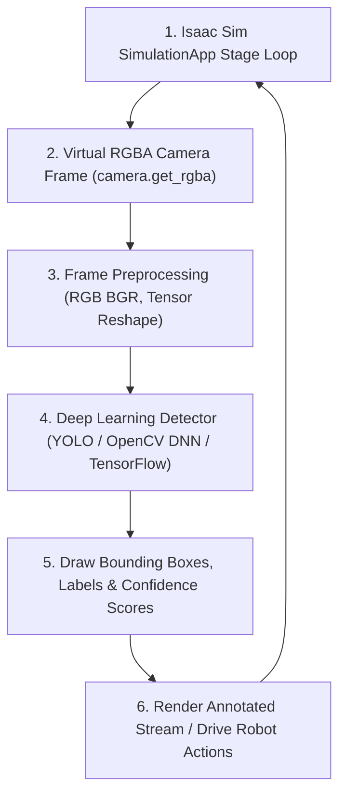

# Lab 8b: ANN using Keras
## Text Classification Using Keras

By right you should have Tensorflow installed, if not run `pip install tensorflow`. Let's start by importing the required libraries.

```python
import tensorflow as tf
from tensorflow.keras.preprocessing.text import Tokenizer
from tensorflow.keras.preprocessing.sequence import pad_sequences
from tensorflow.keras.models import Sequential
from tensorflow.keras.layers import Embedding, LSTM, Dense, Dropout
from tensorflow.keras.datasets import imdb
from sklearn.model_selection import train_test_split
import numpy as np
```

### Load and Explore the Dataset

The IMDb dataset contains 50,000 movie reviews, split equally into training and test sets.

```python
# Load the IMDb dataset (only keep the top 10,000 most common words)
vocab_size = 10000
max_length = 100
(x_train, y_train), (x_test, y_test) = imdb.load_data(num_words=vocab_size)


# View a sample
print(f"First review (encoded): {x_train[0]}")
print(f"Label (0=negative, 1=positive): {y_train[0]}")
```

The data comes in encoded. We need to decode it see the original text.

```python
word_index = imdb.get_word_index()
reverse_word_index = {v: k for k, v in word_index.items()}

def decode_review(encoded_review):
    return " ".join([reverse_word_index.get(i - 3, "?") for i in encoded_review])

decoded_review = decode_review(x_train[0])
print(f"Review: {decoded_review}")
```

### Preprocess the Data

We need to pad or truncate reviews to a fixed length for consistent input size.

```python
x_train = pad_sequences(x_train, maxlen=max_length, padding='post', truncating='post')
x_test = pad_sequences(x_test, maxlen=max_length, padding='post', truncating='post')

padded_review = decode_review(x_train[0])
print(f"Review after padding: {padded_review}")
```

### Build the Model

We'll use an embedding layer to represent words as dense vectors, followed by an LSTM layer for sequence modeling.

```mermaid
graph LR
    InputText["Raw Text Review"] --> Token["Tokenizer / Integer Indices"]
    Token --> Pad["Pad Sequences (length 100)"]
    Pad --> Emb["Embedding Layer (10000 -> 32)"]
    Emb --> LSTM["LSTM Layer (64 units)"]
    LSTM --> Drop["Dropout Layer (0.5)"]
    Drop --> Dense1["Dense Layer (64, ReLU)"]
    Dense1 --> Out["Dense Output (1, Sigmoid)"]
    Out --> Prediction["Sentiment (0=Negative, 1=Positive)"]
```



```python
model = Sequential([
    Embedding(input_dim=vocab_size, output_dim=32, input_length=max_length),
    LSTM(64, return_sequences=False),
    Dropout(0.5),
    Dense(64, activation='relu'),
    Dense(1, activation='sigmoid')  # Binary classification (0 or 1)
])

model.compile(optimizer='adam', loss='binary_crossentropy', metrics=['accuracy'])
```

### Train the Model

Train the model with the training dataset. We get the validation set using the parameter `validation_split`,  instead of doing it explicitly like in the Image Classification Lab. 

```python
history = model.fit(
    x_train, y_train,
    validation_split=0.2,
    epochs=5,
    batch_size=32,
    verbose=2
)
```

### Evaluate the Model

Evaluate the model's performance on the test set.

```python
test_loss, test_accuracy = model.evaluate(x_test, y_test, verbose=2)
print(f"Test Accuracy: {test_accuracy * 100:.2f}%")
```

### Visualize Training Results (optional)

```python
import matplotlib.pyplot as plt

# Plot accuracy
plt.plot(history.history['accuracy'], label='Training Accuracy')
plt.plot(history.history['val_accuracy'], label='Validation Accuracy')
plt.title('Accuracy over Epochs')
plt.xlabel('Epochs')
plt.ylabel('Accuracy')
plt.legend()
plt.show()

# Plot loss
plt.plot(history.history['loss'], label='Training Loss')
plt.plot(history.history['val_loss'], label='Validation Loss')
plt.title('Loss over Epochs')
plt.xlabel('Epochs')
plt.ylabel('Loss')
plt.legend()
plt.show()
```

### Make Predictions

Use the trained model to predict sentiment for new text data.

```python
prediction = model.predict(x_test[:1])
print(f"Predicted Sentiment: {'Positive' if prediction[0][0] > 0.5 else 'Negative'}")
# look at the predicted text
decode_review(x_test[:1][0])
```

---

You can download the full Python script here: [lab8b_keras_lstm.py](files/lab8b_keras_lstm.py)

---


## NVIDIA Isaac Sim Example: Real-Time Stream Capture and Deep Learning Object Detection

In virtual robotics simulation, computer vision pipelines process live camera streams to detect objects, track obstacles, and guide autonomous agents. In this section, we extend NVIDIA Isaac Sim to continuously capture live synthetic camera frames in a simulation loop, perform deep learning object detection, and visualize bounding boxes and detected class labels on the virtual scene.

### Real-Time Detection Architecture

1. **Simulation App & Stage**: Launches Isaac Sim physics & rendering loop (`SimulationApp`).
2. **Virtual Camera Stream**: Continuously extracts synthetic camera frames (`camera.get_rgba()`).
3. **Deep Learning Detector**: Processes each frame using a deep learning object detection model (e.g., OpenCV DNN / TensorFlow Object Detection / YOLO).
4. **Bounding Box Visualization**: Draws detection boxes, class labels, and confidence scores onto the simulated video feed.



### Implementation Script

You can download the full Python script here: [isaac_vision_detection.py](files/isaac_vision_detection.py)

Below is the complete standalone Python script for real-time camera stream capture and object detection:

```python
# Copyright Author: Dr Tang Tiong Yew
"""
Real-Time Stream Capture and Deep Learning Object Detection in NVIDIA Isaac Sim
================================================================================
This script demonstrates continuous synthetic camera video stream capture in NVIDIA Isaac Sim,
performing deep learning object detection (MobileNet SSD / OpenCV DNN) frame-by-frame.

Execution Modes:
1. NVIDIA Isaac Sim Mode (Full 3D GPU physics & visual camera stream):
   Run with Isaac Sim's standalone python:
   `isaac-sim.standalone.bat python src/files/isaac_vision_detection.py`
   OR `python.bat src/files/isaac_vision_detection.py`

2. OpenCV Standalone Fallback Mode (Object Detection Stream Simulation):
   `python src/files/isaac_vision_detection.py`
"""

import sys
import time
import numpy as np

# Try importing OpenCV and TensorFlow
try:
    import cv2
    HAS_OPENCV = True
except ImportError:
    HAS_OPENCV = False

# Try importing NVIDIA Isaac Sim modules
HAS_ISAAC_SIM = False
try:
    from isaacsim import SimulationApp
    HAS_ISAAC_SIM = True
except ImportError:
    try:
        from omni.isaac.kit import SimulationApp
        HAS_ISAAC_SIM = True
    except ImportError:
        HAS_ISAAC_SIM = False


CLASSES = [
    "background", "aeroplane", "bicycle", "bird", "boat",
    "bottle", "bus", "car", "cat", "chair", "cow", "diningtable",
    "dog", "horse", "motorbike", "person", "pottedplant", "sheep",
    "sofa", "train", "tvmonitor"
]


# =====================================================================
# 1. NVIDIA Isaac Sim Implementation
# =====================================================================
def run_isaac_sim_detection(max_frames=100, visualization_fps=2):
    """Continuous camera stream capture & object detection in NVIDIA Isaac Sim."""
    try:
        from isaacsim import SimulationApp
        simulation_app = SimulationApp({"headless": False})
    except ImportError:
        from omni.isaac.kit import SimulationApp
        simulation_app = SimulationApp({"headless": False})

    # Isaac Sim 6 moved the legacy ``omni.isaac`` modules under
    # ``isaacsim``.  These APIs remain supported by the installed version.
    from isaacsim.core.api import World
    from isaacsim.sensors.camera import Camera

    world = World()

    # Avoid ``add_default_ground_plane()``, which references a remote Isaac
    # asset.  A native USD plane keeps this example self-contained when the
    # asset server is unavailable.
    from pxr import UsdGeom

    ground_plane = UsdGeom.Plane.Define(world.stage, "/World/GroundPlane")
    ground_plane.CreateAxisAttr("Z")
    ground_plane.CreateWidthAttr(20.0)
    ground_plane.CreateLengthAttr(20.0)

    camera = Camera(
        prim_path="/World/RobotCamera",
        position=np.array([3.0, 3.0, 2.0]),
        resolution=(640, 480)
    )
    camera.initialize()
    world.reset()

    # Attempt loading MobileNet SSD Caffe model if files exist
    net = None
    if HAS_OPENCV:
        try:
            net = cv2.dnn.readNetFromCaffe("deploy.prototxt", "mobilenet_iter_73000.caffemodel")
            print("[INFO] OpenCV MobileNet SSD network loaded successfully.")
        except Exception:
            print("[INFO] MobileNet SSD caffe model files not found locally. Using heuristic/dummy detection parser.")

    print("[INFO] Starting real-time Isaac Sim image capture & detection loop...")

    frame_count = 0
    frame_delay = 1.0 / visualization_fps if visualization_fps > 0 else 0.0
    while simulation_app.is_running() and frame_count < max_frames:
        world.step(render=True)

        rgba_frame = camera.get_rgba()
        if rgba_frame is None or rgba_frame.size == 0:
            continue

        rgb_frame = rgba_frame[:, :, :3]
        (h, w) = rgb_frame.shape[:2]

        if net is not None and HAS_OPENCV:
            blob = cv2.dnn.blobFromImage(cv2.resize(rgb_frame, (300, 300)), 0.007843, (300, 300), 127.5)
            net.setInput(blob)
            detections = net.forward()

            for i in range(0, detections.shape[2]):
                confidence = detections[0, 0, i, 2]
                if confidence > 0.5:
                    idx = int(detections[0, 0, i, 1])
                    box = detections[0, 0, i, 3:7] * np.array([w, h, w, h])
                    (startX, startY, endX, endY) = box.astype("int")
                    label = f"{CLASSES[idx]}: {confidence * 100:.1f}%"
                    print(f"[Frame {frame_count:03d}] Detected {label} at [{startX}, {startY}, {endX}, {endY}]")
        else:
            # Simulated object detection logging
            if frame_count % 15 == 0:
                dummy_idx = (frame_count // 15) % (len(CLASSES) - 1) + 1
                conf = 0.82 + (frame_count % 10) * 0.01
                bbox = [50, 60, 200, 220]
                print(f"[Frame {frame_count:03d}] Detected {CLASSES[dummy_idx]}: {conf*100:.1f}% at bbox={bbox}")

        frame_count += 1

        # Let the viewport render at a human-observable pace instead of
        # completing the demonstration as fast as the hardware allows.
        if frame_delay:
            time.sleep(frame_delay)

    print("[SUCCESS] Completed real-time simulation object detection loop.")
    simulation_app.close()


# =====================================================================
# 2. Standalone Fallback Execution
# =====================================================================
def run_fallback_detection(max_frames=50):
    """Fallback simulation running continuous video stream detection on synthetic frames."""
    print("=======================================================================")
    print(" Running Standalone Real-Time Object Detection (No Isaac Sim GUI)     ")
    print("=======================================================================")

    for frame_count in range(max_frames):
        synthetic_frame = np.random.randint(0, 255, (480, 640, 3), dtype=np.uint8)
        (h, w) = synthetic_frame.shape[:2]

        if frame_count % 10 == 0:
            target_class = CLASSES[(frame_count // 10) % len(CLASSES)]
            confidence = 0.75 + (frame_count % 5) * 0.04
            startX, startY = 100 + frame_count * 2, 80 + frame_count
            endX, endY = startX + 150, startY + 120
            
            if HAS_OPENCV:
                cv2.rectangle(synthetic_frame, (startX, startY), (endX, endY), (0, 255, 0), 2)
                cv2.putText(synthetic_frame, f"{target_class}: {confidence*100:.1f}%", 
                            (startX, startY - 10), cv2.FONT_HERSHEY_SIMPLEX, 0.5, (0, 255, 0), 2)

            print(f"[Frame {frame_count:03d}] Object Detected: {target_class:<12} | Confidence: {confidence*100:.1f}% | BBox: [{startX}, {startY}, {endX}, {endY}]")

    print("[SUCCESS] Standalone real-time object detection stream simulation finished cleanly.")


if __name__ == '__main__':
    if HAS_ISAAC_SIM:
        print("[INFO] NVIDIA Isaac Sim detected. Starting stream capture loop...")
        run_isaac_sim_detection()
    else:
        print("[INFO] NVIDIA Isaac Sim environment not detected. Running Standalone Mode.")
        run_fallback_detection()

```

---

<footer style="text-align: center; margin-top: 2em; opacity: 0.8; font-size: 0.85em;">
Copyright Author: Dr Tang Tiong Yew
</footer>
